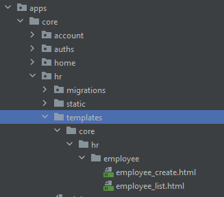
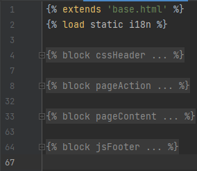
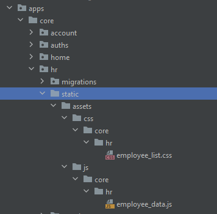

# Management Information System (MIS)

---
## Instruction new feature
Tuân thủ quy tắc RESTful API, Django và khung DRF (Django Restframework).

### Views: Phân thành 2 loại views: 1 dành cho việc render, 1 dành cho việc handle data.
1. view render: xử lý việc render HTML và khung trang web. dùng cho render khung danh sách (hoặc chi tiết, chỉnh sửa) 
```python
from django.views import View
from apps.shared import mask_view
from rest_framework import status


class EmployeeList(View):
    @mask_view(
        auth_require=True,
        template='core/hr/employee/employee_list.html',
        breadcrumb='EMPLOYEE_LIST_PAGE',
        menu_active='menu-employee-list',
    )
    def get(self, request, *args, **kwargs):
        return {}, status.HTTP_200_OK
# DATA RETURN:
# {}: dữ liệu được truyền vào template khi render thông qua biến data
#   VD: {"user_id": "1"} => trong template sử dụng data.user_id
# status.HTTP_200_OK: trạng thái trả về 
#   Với trạng thái 401: Redirect sang login page
#   Vưới trạng thái 500: Thông báo lỗi server
#   etc...
```
2. view handle data: Xử lý việc lấy/cập nhật dữ liệu hỗ trợ giao tiếp browser --> UI --> API --> UI --> Browser
```python
from rest_framework.views import APIView
from rest_framework.permissions import IsAuthenticated
from apps.shared import mask_view, ServerAPI, ApiURL
from rest_framework import status


class EmployeeListAPI(APIView):
    permission_classes = [IsAuthenticated]

    @mask_view(auth_require=True, is_api=True)
    def get(self, request, *args, **kwargs):
        resp = ServerAPI(url=ApiURL.EMPLOYEE_LIST, user=request.user).get()
        if resp.state:
            return {'employee_list': resp.result}, status.HTTP_200_OK
        elif resp.status == 401:
            return {}, status.HTTP_401_UNAUTHORIZED
        return {'errors': resp.errors}, status.HTTP_400_BAD_REQUEST
# DATA RETURN:
# {}: dữ liệu trả về cho request.
#   VD: {"user_list": [1]} => phần $.fn.callAjax resolve{} sẽ trả về data này để xử lý.
# status.HTTP_200_OK: trạng thái trả về
#   Với trạng thái 401: trả tín hiệu về $.fn.callAjax reject{} tự chuyển hướng sang LoginPage.
#   Với trạng thái 500: trả thông tin về $.fn.callAjax reject{} thông báo notify lên giao diện.
```

### Urls: Điều hướng đường dẫn (cẩn thận việc sử dụng regex và variable trong thứ tự các URL) (**Chú ý name của path luôn luôn phải trùng với tên class view**)
1. với view render sử dụng chuẩn URL của RESTfull
```python
urlpatterns = [
    path('employee', EmployeeList.as_view(), name='EmployeeList'),
]
```
2. với view api sử dụng URL view render + "/api"
```python
urlpatterns = [
    path('employee/api', EmployeeListAPI.as_view(), name='EmployeeListAPI'),
]
```

### Template: Mẫu sử dụng để render khung cho page
1. Luôn kế thừa từ base.html
2. Sử dụng 
   1. Folder template root khi sử dụng chung HTML đó cho toàn hệ thống
   2. Tạo folder template trong apps khi cần sử dụng riêng chức năng đó. Tạo cấu trước thư mục trong template giống y cấu trúc thư mục từ "apps" folder đến app đang sử dụng
   3. VD: có app "A" nằm ở apps/core/A => tạo template sẽ được tạo apps/core/A/template/core/A/{file HTML|folder}
   4. 
2. Sử dụng load để sử dụng templatetag: 
   1. static: static trỏ đến static folder
   2. i18n: để sử dụng translate 
   3. etc... https://docs.djangoproject.com/en/4.1/ref/templates/builtins/
3. CSS: Thêm css trong block cssHeader
4. JS:
   1. Thêm js load trước HTML vào block jsHeader
   2. Thêm js load sau HTML vào block jsFooter
6. ACTION PAGE: các action của page vào block pageAction
   1. Thêm href vào thẻ <a href=""></a> nếu muốn điều hướng
   2. Để gắn nút thao tác form vào thẻ <a/> class "btn_support_submit" và attribute data-form-id="frm_employee_create" với frm_employee_create là ID của form
7. CONTENT PAGE: Thêm dữ liệu page vào block pageContent
8. FORM: Với form submit sử dụng các attribute của thẻ form
   1. data-url: url khi submit form
   2. data-method: method khi submit form
   3. data-redirect: đường dẫn khi submit form thành công
   4. sử dụng jQuery để gọi điều hướng form submit
9. Tổng quan:

    

### Static: Các file asset bao gồm static và media hỗ trợ cho HTML và dữ lịệu
1. Sử dụng cho tất cả các chỗ thêm file vào folder static
2. Sử dụng riêng chức năng tạo folder static trong apps và tạo đường dẫn trong folder static đó theo giống đường dẫn từ folder "apps" đến apps name
   1. VD: có app "A" nằm ở apps/core/A => tạo static sẽ được tạo apps/core/A/static/core/A/{css|js}/file
   2. 
3. Import JS không cần thiết load trước HTML ở JSFooter block.

### Notify:
1. Sử dụng $.fn.notifyB({'title': '','description': ""|[""]) [recommend]
2. Sử dụng $.fn.notifyPopup({'title': '','description': ""|[""])

### Tham khảo các thiết kế UI tại template đã mua: 
1. Bản cứng: [Microsoft Team Group]
2. Bản online: https://nubra-ui.hencework.com/index.html

---

### Select2 how to use
1. Description
```text
plugin using for combobox with auto init and search real time
```
2. setup
```html
1.1 DOCS
   + please follow path file bellow and good luck :D
```
*[vendors/select2/dist/js/init-select2.js](/statics/vendors/select2/dist/js/init-select2.js)*

---

### dataTables how to use
1. Description
```text
plugin using for tables.
tables list each page is had difference setup. so dataTable did not common file for default setup.
visit workflow list page to refer way how to setup.
good luck..
```

---

### Mask Money
```html
<!-- input currency with get value -->
<input 
        type="text" 
        id="input-test-mask"
        class="form-control mask-money"
        value="123.99"
        data-return-type="text"
/>
<!-- display number to currency -->
<p class="mask-money-value" data-mask-value="77.89"></p>
```
```js
// get value of input currency
$('#input-test-mask').valCurrency();
// parse input and display auto run in base.html
```
1. Cho thẻ input
   1. [*] Bắt buộc là thẻ input
   2. [*] type: text
   3. [*] class: mask-money
   4. value: "123.99" nếu cần load dữ liệu mặc định
   5. data-return-type: "text"(default) hoặc "number" để định nghĩa kiểu dữ liệu khi gọi $('input').valCurrency()
   6. Trong quá trình init mask money sẽ thêm vào các attribute vào element input đó: data-precision, data-decimal
   7. Gọi valCurrency() sẽ trả lỗi nếu cấu hình và quá trình trả dữ liệu có sự cố --> chống đẩy dữ liệu rác lên server
2. Cho việc hiển thị khác
   1. Có thể là thẻ bất kì hiển thị giá trị text() trong thẻ
   2. class: mask-money-value
   3. data-mask-value="77.89" là giá trị được hiển thị
   4. JS sẽ thực thi replace các giá trị này để hiển thị tự động nếu kế thừa từ base.html
---