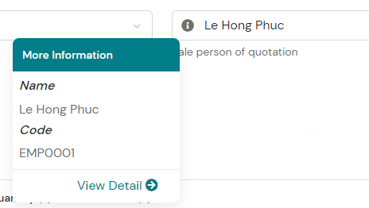
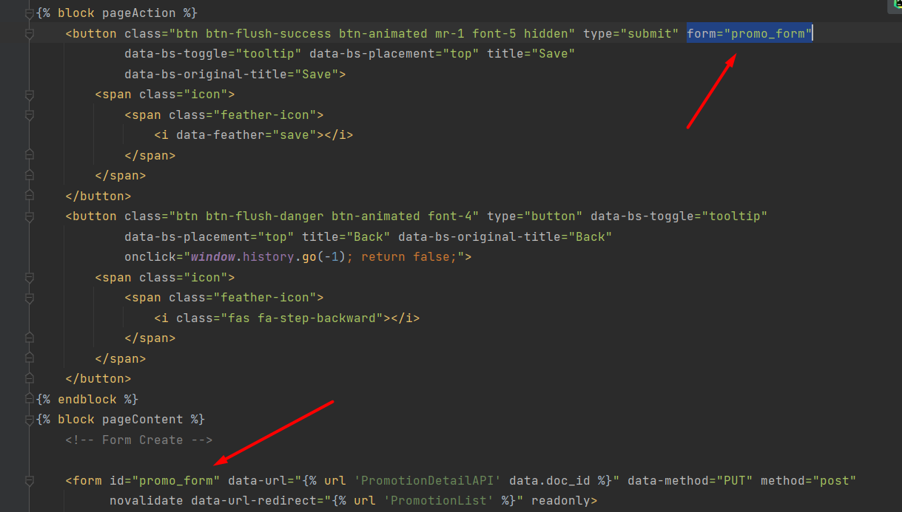

# Management Information System (MIS)

---

## Instruction new feature

Tuân thủ quy tắc RESTful API, Django và khung DRF (Django Restframework).

### Views: Phân thành 2 loại views: 1 dành cho việc render, 1 dành cho việc handle data.

1. view render: xử lý việc render HTML và khung trang web. dùng cho render khung danh sách (hoặc chi tiết, chỉnh sửa)

```python
from django.views import View
from apps.shared import mask_view
from rest_framework import status


class EmployeeList(View):
    @mask_view(
        auth_require=True,
        template='core/hr/employee/employee_list.html',
        breadcrumb='EMPLOYEE_LIST_PAGE',
        menu_active='menu-employee-list',
    )
    def get(self, request, *args, **kwargs):
        return {}, status.HTTP_200_OK
# DATA RETURN:
# {}: dữ liệu được truyền vào template khi render thông qua biến data
#   VD: {"user_id": "1"} => trong template sử dụng data.user_id
# status.HTTP_200_OK: trạng thái trả về 
#   Với trạng thái 401: Redirect sang login page
#   Vưới trạng thái 500: Thông báo lỗi server
#   etc...
```

2. view handle data: Xử lý việc lấy/cập nhật dữ liệu hỗ trợ giao tiếp browser --> UI --> API --> UI --> Browser

```python
from rest_framework.views import APIView
from rest_framework.permissions import IsAuthenticated
from apps.shared import mask_view, ServerAPI, ApiURL
from rest_framework import status


class EmployeeListAPI(APIView):
    permission_classes = [IsAuthenticated]

    @mask_view(auth_require=True, is_api=True)
    def get(self, request, *args, **kwargs):
        resp = ServerAPI(request=request, url=ApiURL.EMPLOYEE_LIST, user=request.user).get()
        return resp.auto_return(key_success='employee_list', callback_success=None, status_success=status.HTTP_200_OK)
# DATA RETURN:
# {}: dữ liệu trả về cho request.
#   VD: {"user_list": [1]} => phần $.fn.callAjax resolve{} sẽ trả về data này để xử lý.
# status.HTTP_200_OK: trạng thái trả về
#   Với trạng thái 401: trả tín hiệu về $.fn.callAjax reject{} tự chuyển hướng sang LoginPage.
#   Với trạng thái 500: trả thông tin về $.fn.callAjax reject{} thông báo notify lên giao diện.
```

### Urls: Điều hướng đường dẫn (cẩn thận việc sử dụng regex và variable trong thứ tự các URL) (**Chú ý name của path

luôn luôn phải trùng với tên class view**)

1. với view render sử dụng chuẩn URL của RESTfull

```python
urlpatterns = [
    path('employee', EmployeeList.as_view(), name='EmployeeList'),
]
```

2. với view api sử dụng URL view render + "/api"

```python
urlpatterns = [
    path('employee/api', EmployeeListAPI.as_view(), name='EmployeeListAPI'),
]
```

### Template: Mẫu sử dụng để render khung cho page

1. Luôn kế thừa từ base.html
2. Sử dụng
    1. Folder template root khi sử dụng chung HTML đó cho toàn hệ thống
    2. Tạo folder template trong apps khi cần sử dụng riêng chức năng đó. Tạo cấu trước thư mục trong template giống y
       cấu trúc thư mục từ "apps" folder đến app đang sử dụng
    3. VD: có app "A" nằm ở apps/core/A => tạo template sẽ được tạo apps/core/A/template/core/A/{file HTML|folder}
    4. 
2. Sử dụng load để sử dụng templatetag: 
    1. static: static trỏ đến static folder
    2. i18n: để sử dụng translate 
    3. etc... https://docs.djangoproject.com/en/4.1/ref/templates/builtins/
3. CSS: Thêm css trong block cssHeader
4. JS:
    1. Thêm js load trước HTML vào block jsHeader
    2. Thêm js load sau HTML vào block jsFooter
6. ACTION PAGE: các action của page vào block pageAction
    1. Thêm href vào thẻ <a href=""></a> nếu muốn điều hướng
    2. Để gắn nút thao tác form vào thẻ <a/> class "btn_support_submit" và attribute data-form-id="frm_employee_create"
       với frm_employee_create là ID của form
7. CONTENT PAGE: Thêm dữ liệu page vào block pageContent
8. FORM: Với form submit sử dụng các attribute của thẻ form
    1. data-url: url khi submit form
    2. data-method: method khi submit form
    3. data-redirect: đường dẫn khi submit form thành công
    4. sử dụng jQuery để gọi điều hướng form submit
9. Tổng quan:

   

### Static: Các file asset bao gồm static và media hỗ trợ cho HTML và dữ lịệu

1. Sử dụng cho tất cả các chỗ thêm file vào folder static
2. Sử dụng riêng chức năng tạo folder static trong apps và tạo đường dẫn trong folder static đó theo giống đường dẫn từ
   folder "apps" đến apps name
    1. VD: có app "A" nằm ở apps/core/A => tạo static sẽ được tạo apps/core/A/static/core/A/{css|js}/file
    2. 
3. Import JS không cần thiết load trước HTML ở JSFooter block.

### Notify:

1. Sử dụng $.fn.notifyB({'title': '','description': ""|[""]) [recommend]
2. Sử dụng $.fn.notifyB({'title': '','description': ""|[""])

### Tham khảo các thiết kế UI tại template đã mua:

1. Bản cứng: [Microsoft Team Group]
2. Bản online: https://nubra-ui.hencework.com/index.html

---

### Select2 how to use

1. Description

```text
plugin using for combobox with auto init and search real time
```

2. setup

```html
1.1 DOCS
+ please follow path file bellow and good luck :D
```

*[vendors/select2/dist/js/init-select2.js](/statics/vendors/select2/dist/js/init-select2.js)*

3. select combobox with icon INFO
   

```text
 follow how to setup in init-select2.js line 18
```

---

### dataTables how to use

1. Description

```text
plugin using for tables.
tables list each page is had difference setup. so dataTable did not common file for default setup.
visit workflow list page to refer way how to setup.
good luck..
```

---

### Mask Money

```html
<!-- input currency with get value -->
<input
        type="text"
        id="input-test-mask"
        class="form-control mask-money"
        value=123.99
        data-return-type="text"
/>
<!-- display number to currency -->
<span class="mask-money" data-init-money=77.89></span>
```

```js
// init mask money
$.fn.initMaskMoney2();
// get value of input currency
$('#input-test-mask').valCurrency();
```

1. Cho thẻ input
    1. [*] Bắt buộc là thẻ input
    2. [*] type: text
    3. [*] class: mask-money
    4. value: "123.99" nếu cần load dữ liệu mặc định
    5. data-return-type: "text"(default) hoặc "number" để định nghĩa kiểu dữ liệu khi gọi $('input').valCurrency()
    6. Trong quá trình init mask money sẽ thêm vào các attribute vào element input đó: data-precision, data-decimal
    7. Gọi valCurrency() sẽ trả lỗi nếu cấu hình và quá trình trả dữ liệu có sự cố --> chống đẩy dữ liệu rác lên server
2. Cho việc hiển thị khác
    1. Có thể là thẻ bất kì hiển thị giá trị text() trong thẻ
    2. class: mask-money-value
    3. data-mask-value="77.89" là giá trị được hiển thị
    4. JS sẽ thực thi replace các giá trị này để hiển thị tự động nếu kế thừa từ base.html

---

### File upload setup

```html

<button
        type="button"
        class="form-control btn btn-success btn-file-upload"
        data-f-input-name="inputTest1"
        data-f-input-required="true"
        data-f-name-ele-id="#idDisplayFileNameUploaded"
>
    Click me to upload file!
</button>
```

```text
- Attribute
   class: "btn-file-upload"
   data-f-input-name: tên của input khi submit form
   data-f-input-required: thêm required vào input require khi submit | default: false
   data-f-name-ele-id: id cuả thẻ muốn hiển thị tên file sau khi upload | default: thêm small.form-text sau class btn-file-upload
// Attribute
- Return
   Giá trị trong form khi submit là ID của attachment trên Cloud 
// Return -->
- Notes
    Nên thêm class form-control vào thẻ chứa class .btn-file-upload để sử dụng các style giống như 1 input
// Notes
```

```javascript
// sự kiện khởi tạo button đã được khởi tạo trong ListeningEventController.activeFileUpload()
// Khởi tạo đầy đủ
new ListeningEventController().activeFileUpload()
// Khởi tạo thực tế 
FileUtils.init();
// Khởi tạo 1 thành phần jquery
FileUtils.init($('element'));
```

---

### form template detail and update

#### 1. intro

```text
mặc định load update page là detail page, khi click vào input thì sẽ bật chức năng edit cho form đó
```

#### 2. HTML setup

tham khảo page promotion_detail.html

1. INPUT, TEXTAREA, DATEPICKED,

```html

<div class="readonly">
    <input class="form-control" type="text" name="title" id="title" required readonly>
    <span></span>
</div>
```

+ div có class readonly bao ngoài
+ thẻ input có attribute **readonly**
+ cùng cấp thẻ input sẽ có một tag span rỗng

2. SELECT dropdown mặc định, SELECT COMBOBOX có sử dụng plugin SELECT2

```html

<div class="readonly">
    <select
            class="form-control"
            name="currency"
            id="currency"
            data-multiple="false"
            data-prefix="currency_list"
            data-url=""
            disabled
    ></select>
    <span></span>
</div>
```

+ div có class readonly bao ngoài
+ thẻ select có attribute **disabled**
+ cùng cấp thẻ select sẽ có một tag span rỗng.

3. CHECKBOX, RADIO

```html

<div class="form-check form-check-lg readonly">
    <input
            type="checkbox" class="form-check-input" name="is_discount" id="is_discount"
            checked disabled
    >
    <label class="form-check-label" for="is_discount"></label>
    <span></span>
</div>
```

+ div có class readonly bao ngoài
+ thẻ input có attribute **disabled**
+ cùng cấp thẻ input sẽ có một tag span rỗng.

4. SELECT COMBOBOX có ICON info

```html

<div class="input-group readonly">
    <div class="input-affix-wrapper">
        <div class="dropdown input-prefix">
            <i
                    class="fas fa-info-circle"
                    data-bs-toggle="dropdown"
                    data-dropdown-animation
                    aria-haspopup="true"
                    aria-expanded="false"
                    disabled
            ></i>
            <div class="dropdown-menu w-210p mt-2">
            </div>
        </div>
        <select
                class="form-control dropdown-select_two" disabled
                name="product_selected"
                id="product_selected"
                data-multiple="false"
                data-prefix="product_list"
                data-url=""
                data-link-detail=""
                data-template-format="[{'name':'Title', 'value': 'title'},{'name':'Code', 'value': 'code'}]"
        ></select>
    </div>
    <span></span>
</div>
```

+ div ngoài cùng có class readonly
+ thẻ select có attribute **disabled**
+ cùng cấp div.**input-affix-wrapper** sẽ có một tag span rỗng.

4. TABLE và TABLE có button ADD

```html

<div class="readonly table-readonly">
    <table></table>
    <span></span>
</div>

<button data-table-readonly disabled></button>
```

+ div có class readonly và table-readonly bao ngoài
+ nếu có button add thì button có attribute là **disabled** và **data-table-readonly**
+ cùng cấp thẻ table sẽ có một tag span rỗng.

----------------------

+ BUTTON update thêm attribute form cho button với value là id của form. thêm class hidden để mặc định ẩn button
+ 

```html 
form="promo_form" 
```

5. js setup
   ờ function submit form thêm đoạn code sau, do form sẽ không tự động lấy các field có attribute là disabled nên.
   chúng ta sẽ remove tạm thời các attr này, đồng thời sau khi update.
   sẽ redirect về page list tránh trường hợp phải bật lại disabled
   sau khi submit, hoặc có thể reload lại page

```js
    $('.readonly [disabled]:not([hidden]):not(i)', $form).attr('disabled', false)
```

6. Table Data

```text
- Không hiển thị spinner loading khi load data cho table:
    set attribute "load-data-hide-spinner" = "false" để ẩn spinner loading khi gọi ajax lấy dữ liệu cho table đó.
```

7. Notify lỗi không hiển thị key của lỗi (key là trường dữ liệu) khi gọi API trả về

```text
# ở local có thể tắt tất cả notify key bằng local_settings: DEBUG_NOTIFY_KEY = False

@mask_view(is_notify_key=False)
def view(...)
```

## 8. Cách áp dụng WF cho chức năng:

```js
// create.js

$('#form-create-x').submit(function (event) {
    let frm = new SetupFormSubmit($(this));
    frm.dataForm['system_status'] = 1; // 1: save, 0: draft
    $.fn.callAjax(frm.dataUrl, frm.dataMethod, frm.dataForm, csr);
})
```

```js
// detail.js
$.fn.callAjax(url_loaded, 'GET').then(
    (resp) => {
        let data = $.fn.switcherResp(resp);
        if (data) {
            WFRTControl.setWFRuntimeID(data['x_detail']?.['workflow_runtime_id']);
        }
    }
);
```

9. Mọi z-index đều nhỏ hơn 9999

---
#### MEDIA CLOUD Config
<p style="font-weight: bold;color: red;">JSON trong value của .env luôn sử dunng `"`, không được sử dụng `'`.</p>

```text
# .env
MEDIA_DOMAIN=http://127.0.0.1:8881/api
MEDIA_SECRET_TOKEN_UI={KEY_MAP_WITH_SETTING_MEDIA_CLOUD_SV}
```
---

#### Media cloud init input upload

```html
<div class="col-4">
    <div class="form-group">
        <label for="inputTest2" class="form-label">Upload File 2</label>
        <button
            type="button"
            class="form-control btn btn-danger btn-file-upload"
            data-f-input-name="inputTest2"
            data-f-input-required="true"
            data-f-input-disabled="false"
            data-f-name-ele-id="#fileNameTestDisplay"
            data-f-accept=".docx, image/*"
        >Click me!</button>
        <p id="fileNameTestDisplay"></p>
    </div>
</div>
# class: btn-file-upload
# data-f-input-name: Giá trị attribute name của element input text được khởi tạo
# data-f-input-required: (true/false) attribute "required" của thẻ input text được khởi tạo
# data-f-input-disabled: (true/false) attribute "disabled" của thẻ input text được khởi tạo
# data-f-name-ele-id: ID name thẻ hiển thị tên file và dung lượng (không có sẽ tạo <small>)
# data-f-accept: (default: "*": cho phép tất cả) các kiểu file được chấp thuận (hàm valid sẽ valid theo cấu hình), tham khảo tạo: https://developer.mozilla.org/en-US/docs/Web/HTML/Element/input/file
```

##### Default: auto init .btn-file-upload with attribute config

#### Manual || Detail Load: 
```javascript
let btnInputFile = $('#{btnID}');
// or
let btnInputFile = $('.btn-file-upload[data-f-input-name={name_input_init}]')[0];

let dataDetail = {}; 
// detail of file, sample: {'id': ..., 'media_file_id': '', 'file_name': '', 'file_size': 1024, ...}

FileUtils.init(btnInputFile, dataDetail || {})
```
#### Sample in apps\core\home\templates\core\utilities\index.html

---

#### Generate avatar circle

```text
// data là context chứa {'first_name': '', 'last_name': '', 'avatar': ''}
let data = {'first_name': '', 'last_name': '', 'avatar': ''}
```
1. Render
```html

<!-- full frame -->
{{ data|render_avatar:"some class name is size, color of avatar..."|safe }}
<!-- result: <div class="avatar avatar-rounded {exist_class_name if exist_class_name else 'avatar-xs avatar-primary'}">...</div> -->
```
```html

<!-- tag children in avatar -->
{{ data|render_avatar_tag|safe }}
```
2. JS
```js
PersonControl.renderAvatar(data, clsName="some class name is size, color of avatar...")
// result: <div class="avatar avatar-rounded {clsName if clsName else 'avatar-xs avatar-primary'}">...</div>
```

---

#### Reload với thêm '#ID' vào đường dẫn để kích hoạt tab khi load page | kích hoạt được cả tab nằm trong drawer

```javascript
// Sử dụng 1 trong 2 cách

// cách 1 biết được id_tab
$.fn.reloadWithHashID('id_tab_need_active');

// cách 2 đang trỏ đến 1 element nằm trong tab, ví thẻ dụ <span id="ss1"></span> nằm trong tag
$('#ss1').reloadWithHashID();
```

---

## NEW version 2.0

### JS General
> - Thêm một thứ gì đó xử lý riêng biệt nên sử dụng class (thêm nếu chưa có)
> - Thêm class vào $x.cls và $x.fn để sử dụng nhanh (giống $ của jquery)

I. Cài đặt
1. init-setup.js
> - Nơi thiết lập các class xử lý mọi thứ cần thiết ở mọi page
> - Thêm hàm xử lý vào class nếu hàm đó thuộc phạm vi các class có sẵn. Chưa có class thì thêm vào - nhưng hạn chế, tránh rác
2. init-loader.js
> - Nơi thêm các hàm xử lý vào jquery.fn và lắng nghe sự kiện document.ready
> - Có thể thêm các hàm xử lý vào jquery.fn nếu nó sử dụng đối tượng jquery để xử lý. VD: $('#btnABC').loadFail() để thêm chính hiệu ứng vào nút này.
> - Các xử lý khác nên thêm vào $x để sử dụng tránh jquery quá tải/tải lâu khi khởi tạo jquery cho 1 đối tượng.

II. Sử dụng
> - Sử dụng các hàm nào trong jquery.fn.extends bằng $.fn.xxx
> - Sử dụng các hàm trong $x bằng $x.fn.xxx
> - Sử dụng các class trong $x bằng $x.cls.XXX

III. Lưu ý
> Khi thêm 1 class vào init-setup thì nên thêm class đó vào $x.cls
> Thêm các hàm sử dụng nhanh vào $x.fn để sử dụng nhanh không cần nhớ tên class
> Khuyến nghị sử dụng $x để trỏ đến class và fn thay vì nhớ tên class (tận dụng tối đa suggestion của trình biên dịch)


### Call API in VIEW

I. Mô tả
> - ServerAPI().get() hoặc post(),... đều trả về 1 đối tượng RespData
> - RespData có hàm xử lý trả về tự động theo state và status ở RespData.auto_return()
```text
auto_return() có các tham số: 
- key_success [is string, not required, default None]: sử dụng khi trả về với statue=true 
- callback_success [is function, not required, default None]: một hàm xử lý tùy chỉnh nhận vào result và trả ra dữ liệu. (nên tận dụng viết thêm function trong view để sử dụng biến con trỏ của view để lấy ra các thông tin request)
- status_success [is int, not required, default None]: mặc định HTTP_200_OK, thay đổi nếu trả về status khác ở trường hợp state=true
- callback_errors [is function, not required, default None]: hàm xử lý trả về lỗi nếu cần thay đổi cấu trúc trả lỗi

Không yêu cầu tham số nào thì sẽ trả ra mặc định (resp.result, status.HTTP_200_OK)

** Đọc thêm hàm này để sử dụng nếu cần thiết nâng cao hơn.
```

II. Ví dụ mẫu
```python
class XXX(APIView):
    @mask_view(login_require=True, auth_require=True, is_api=True)
    def get(self, request, *args, **kwargs):
        resp = ServerAPI(request=request, user=request.user, url=ApiURL.DELIVERY_LIST).get()
        return resp.auto_return(key_success='delivery_list') # return {'delivery_list': resp.result}, status.HTTP_200_OK

    
class YYY(APIView):
    @mask_view(login_require=True, auth_require=True, is_api=True)
    def get(self, request, *args, **kwargs):
        resp = ServerAPI(request=request, user=request.user, url=ApiURL.DELIVERY_LIST).get()
        if resp.status:
           # handle data
            return {'delivery_list': resp.result}, status.HTTP_200_OK
        return resp.auto_return() # auto handle state = false

```

III. Sử dụng cho các view sử dụng gọi API render context
```python
class ZZZ(View):
    @mask_view(...)
    def get(self, request, *args, **kwargs):
        resp = ServerAPI(user=request.user, url='').get()
        return resp.auto_return(key_success='x')
# Tự động thêm "render_api_status" vào body khi tải page
# base.html sẽ dựa vào "render_api_status" để hiển thị các popup tương ứng với giá trị
# đã xử lý với 401, 403, 404, 500
```

---

Tài liệu này sẽ được làm lại khi mọi thứ đã ổn định!
Nên vui lòng không xóa những gì đang có và thêm những gì vừa được tạo ra vào đây để lưu trữ tránh thiếu tài liệu! 

---