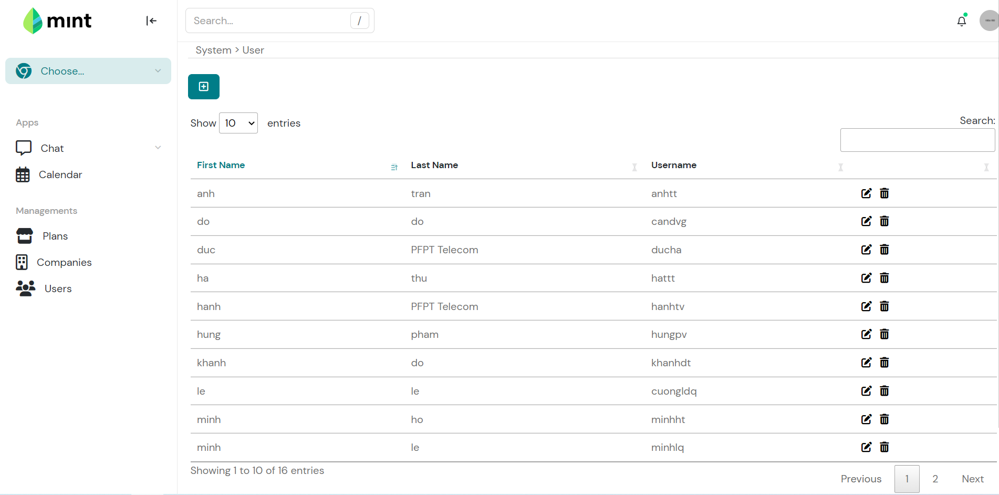
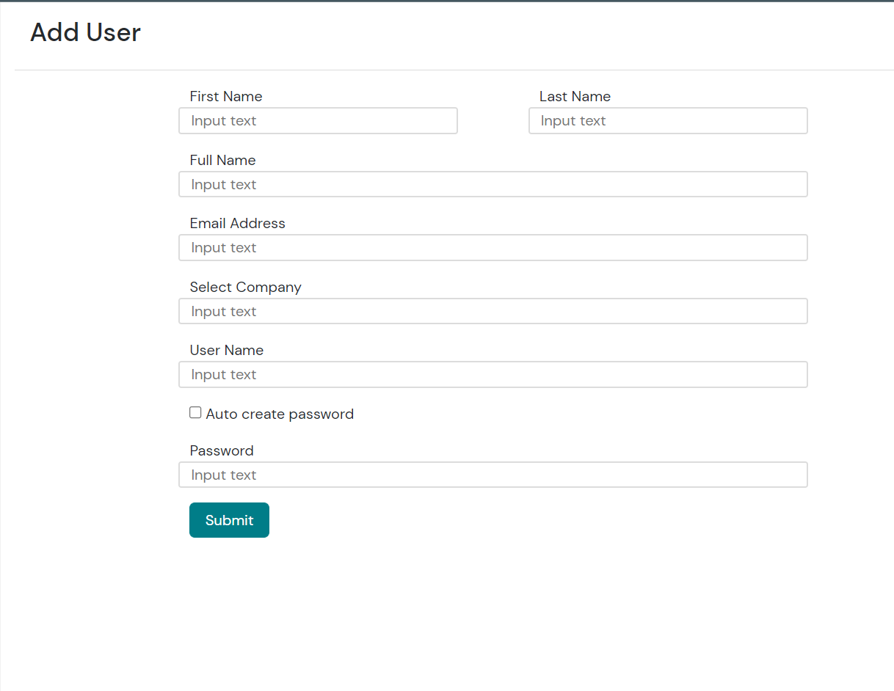
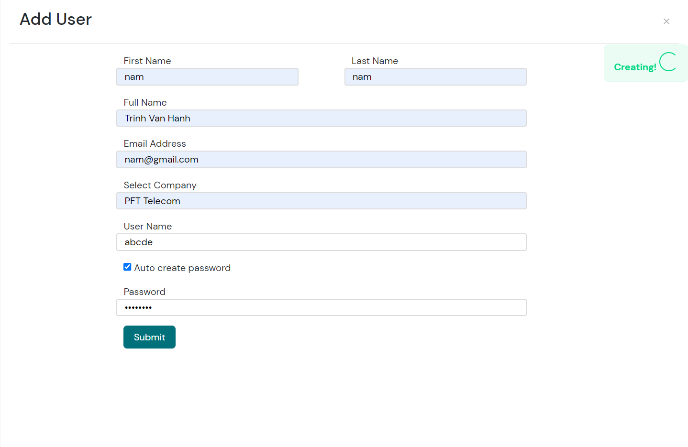

# MIS UI

## UI

- DataTable
    - display user infomation(First Name, Last Name, Username)
- Form add user
    
  - enter information into input tags and submit
    - succesfully show notification and back to user screen
      
    - error show notification error

## API
- Add serializer UserListSerializer
- Add url './users'
- Add UserListView (get, post) with url 'localhost:8001/account/users'
  - get: use Serializer parse data from object to json (for datatable)
  - post: use Serializer to get data form form in UI (first name, last name, email, username, password) and save in database

