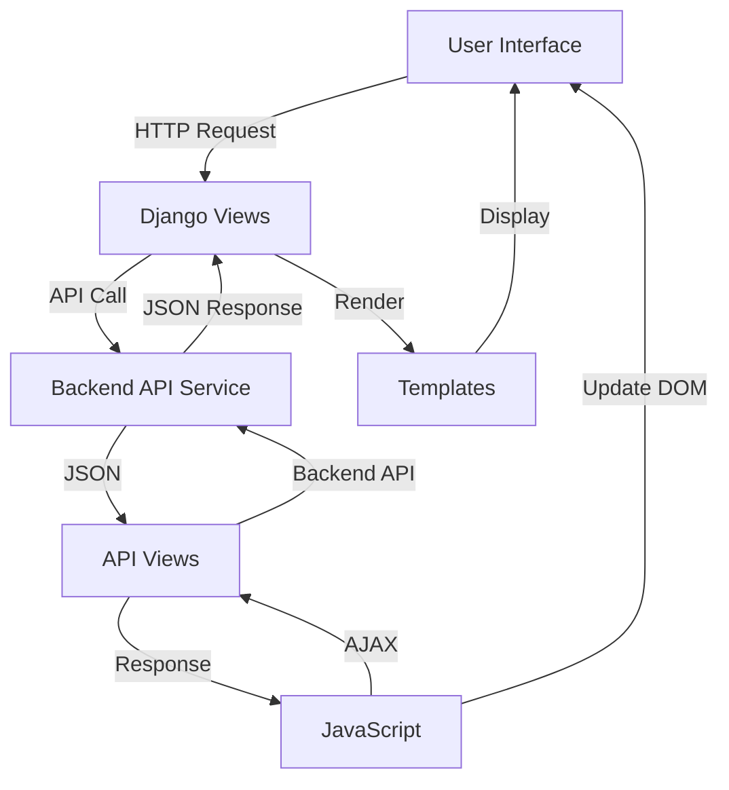

# Quotation Module - Bflow ERP Sales System

## Overview

The Quotation module is a core component of the Bflow ERP Sales Management System, designed to handle the creation, management, and tracking of sales quotations. This module provides comprehensive functionality for sales teams to generate professional quotations, manage pricing, apply discounts, and convert quotations to sales orders.

## Module Structure

```
apps/sales/quotation/
├── __init__.py              # Module initialization
├── admin.py                 # Django admin configuration
├── apps.py                  # Application configuration
├── models.py                # Data models (currently empty - uses API backend)
├── urls.py                  # URL routing configuration
├── views.py                 # View controllers
├── tests.py                 # Test cases
├── migrations/              # Database migrations
├── static/                  # Static assets
│   └── assets/sales/quotation/
│       ├── css/            # Stylesheets
│       │   ├── quotation_config.css
│       │   └── quotation_create.css
│       └── js/             # JavaScript files
│           ├── quotation_common.js
│           ├── quotation_config.js
│           ├── quotation_create.js
│           ├── quotation_detail.js
│           └── quotation_list.js
└── templates/               # HTML templates
    └── sales/quotation/
        ├── config/         # Configuration templates
        ├── quotation_create.html
        ├── quotation_detail.html
        ├── quotation_list.html
        └── quotation_update.html
```

## Features

### 1. Quotation Management
- **List View**: Display all quotations with filtering and sorting capabilities
- **Create Quotation**: Comprehensive form for new quotation creation
- **Edit/Update**: Modify existing quotations
- **Detail View**: View complete quotation information
- **Delete**: Remove quotations with proper authorization

### 2. Product Line Items
- Add multiple products/services to quotations
- Support for both products and services
- Quantity, unit price, and UOM management
- Line-level discount application (percentage)
- Tax calculation per line item
- Automatic total calculation

### 3. Customer Integration
- Link quotations to customer accounts
- Pull customer information automatically
- Contact person selection
- Billing and shipping address management

### 4. Pricing and Calculations
- Multi-currency support
- Discount application (line-level and total)
- Tax calculations with multiple tax rates
- Automatic subtotal and grand total calculation
- Price list integration

### 5. Workflow Integration
- Status management (Draft, Sent, Accepted, Rejected, Expired)
- Approval workflows for high-value quotations
- Integration with opportunity management
- Conversion to sales orders

### 6. Configuration Management
- Quotation numbering sequences
- Default terms and conditions
- Validity period settings
- Indicator/KPI configuration
- Zone-based pricing rules

### 7. Document Management
- PDF generation with company branding
- Email quotations directly to customers
- Attachment support
- Version control for quotation revisions

## Technical Architecture

### Backend Architecture
- **Framework**: Django 4.1.3
- **API Pattern**: RESTful API with Django REST Framework
- **Authentication**: Token-based authentication with permissions
- **Data Storage**: API-based (no local models, communicates with backend microservice)

### Frontend Architecture
- **Templates**: Django template engine
- **JavaScript**: jQuery-based interactive components
- **CSS**: Bootstrap 5 with custom styling
- **DataTables**: Server-side processing for large datasets
- **Select2**: Enhanced dropdown functionality

### API Endpoints

```python
# View Endpoints
/quotation/lists                    # GET - Quotation list page
/quotation/create                   # GET - Create quotation page
/quotation/detail/<id>              # GET - Quotation detail page
/quotation/update/<id>              # GET - Update quotation page
/quotation/config                   # GET - Configuration page

# API Endpoints
/quotation/api/lists                # GET, POST - List/Create quotations
/quotation/detail-api/<id>          # GET, PUT, DELETE - CRUD operations
/quotation/config/api               # GET, PUT - Configuration management
/quotation/indicators/api           # GET, POST - Indicator management
/quotation/indicator-api/<id>       # GET, PUT - Indicator details
/quotation/quotation-expense-list   # GET - Expense list
```

## Key Components

### 1. Views (views.py)

#### QuotationList
- Displays paginated list of quotations
- Server-side DataTable integration
- Advanced filtering capabilities

#### QuotationCreate
- Complex form handling for quotation creation
- Product selection with import functionality
- Dynamic form validation

#### QuotationDetail
- Read-only view of quotation information
- Print and email functionality
- Activity history display

#### QuotationUpdate
- Edit existing quotations
- Version tracking
- Change history logging

### 2. JavaScript Components

#### quotation_create.js
- Form initialization and validation
- Product datatable management
- Dynamic calculation engine
- Customer data loading
- Workflow integration

#### quotation_list.js
- DataTable configuration
- Bulk actions handling
- Quick filters implementation

#### quotation_common.js
- Shared utilities and functions
- Calculation helpers
- Validation rules

### 3. Templates

#### quotation_create.html
- Multi-tab form layout
- Product selection modal
- Customer information section
- Terms and conditions

#### quotation_list.html
- DataTable structure
- Filter sidebar
- Action buttons

## Data Flow



## Security Features

1. **Authentication Required**: All views require user authentication
2. **Permission-based Access**: Role-based permissions for CRUD operations
3. **CSRF Protection**: All forms include CSRF tokens
4. **API Security**: Token-based authentication for API endpoints
5. **Data Validation**: Server-side validation for all inputs

## Integration Points

### 1. Customer Module
- Customer selection and data retrieval
- Contact person management
- Address synchronization

### 2. Product Module
- Product catalog integration
- Price list application
- Inventory checking (optional)

### 3. Opportunity Module
- Create quotations from opportunities
- Link quotations to sales pipeline
- Win/loss tracking

### 4. Sales Order Module
- One-click conversion from quotation
- Data inheritance
- Status synchronization

### 5. Workflow Engine
- Approval routing
- Status transitions
- Notification triggers

## Configuration Options

### 1. General Settings
- Default quotation validity (days)
- Number sequence format
- Default payment terms
- Currency settings

### 2. Indicators/KPIs
- Quotation conversion rate
- Average quotation value
- Response time metrics
- Win/loss ratios

### 3. Zones Configuration
- Geographic pricing zones
- Zone-based discounts
- Delivery charges by zone

## Best Practices

### 1. Performance
- Use server-side pagination for large datasets
- Implement caching for frequently accessed data
- Optimize API calls with proper filtering
- Lazy load related data

### 2. User Experience
- Auto-save draft quotations
- Keyboard shortcuts for common actions
- Clear validation messages
- Responsive design for mobile access

### 3. Data Integrity
- Validate business rules on server
- Implement audit trails
- Use database transactions
- Regular data backups

### 4. Maintenance
- Keep JavaScript modular
- Document API changes
- Version control templates
- Monitor error logs

## Common Use Cases

### 1. Standard Quotation Creation
1. Navigate to Quotation List
2. Click "Create New"
3. Select customer
4. Add products/services
5. Apply discounts/taxes
6. Save and send to customer

### 2. Quotation from Opportunity
1. Open opportunity record
2. Click "Create Quotation"
3. Review pre-filled data
4. Adjust as needed
5. Generate and send

### 3. Quotation Revision
1. Open existing quotation
2. Click "Create Revision"
3. Modify items/prices
4. Save with new version
5. Send updated quotation

### 4. Bulk Quotation Processing
1. Go to Quotation List
2. Select multiple quotations
3. Choose bulk action
4. Confirm operation

## Troubleshooting

### Common Issues

1. **Quotation Not Saving**
   - Check required fields
   - Verify customer selection
   - Ensure at least one product line
   - Check browser console for errors

2. **Calculations Incorrect**
   - Verify tax configuration
   - Check discount application order
   - Review currency settings
   - Validate formula configuration

3. **PDF Generation Fails**
   - Check template configuration
   - Verify logo file exists
   - Review PDF service logs
   - Check memory limits

4. **Performance Issues**
   - Reduce page size in DataTable
   - Enable caching
   - Optimize API queries
   - Check network latency

## Development Guidelines

### Adding New Features
1. Follow Django app structure
2. Maintain API-first approach
3. Update both backend and frontend
4. Add appropriate tests
5. Update documentation

### Code Standards
- Follow PEP 8 for Python code
- Use ESLint for JavaScript
- Maintain consistent naming
- Add docstrings and comments
- Write unit tests

### Testing
- Unit tests for view logic
- Integration tests for API calls
- JavaScript testing with Jest
- End-to-end testing with Selenium
- Performance testing for large datasets

## Future Enhancements

1. **AI-Powered Pricing**
   - Dynamic pricing suggestions
   - Competitive analysis
   - Margin optimization

2. **Advanced Analytics**
   - Quotation funnel analysis
   - Customer behavior insights
   - Predictive win rates

3. **Mobile Application**
   - Native mobile app
   - Offline capability
   - Push notifications

4. **Integration Expansion**
   - CRM system integration
   - E-signature support
   - Payment gateway integration

## Support and Maintenance

### Regular Maintenance Tasks
- Review and archive old quotations
- Update product prices
- Check quotation expiry
- Monitor conversion rates
- Clean up draft quotations

### Performance Monitoring
- API response times
- Page load speeds
- Database query efficiency
- Error rate tracking
- User activity analysis

### Backup and Recovery
- Daily data backups
- Quotation template backups
- Configuration snapshots
- Disaster recovery plan
- Data retention policy

## Contact Information

- **Module Owner**: Sales Team
- **Technical Lead**: Development Team
- **Support Email**: support@bflow-erp.com
- **Documentation**: [Internal Wiki Link]
- **Issue Tracking**: [JIRA/GitHub Issues]

---

**Last Updated**: 2025-07-25  
**Version**: 1.0.0  
**Next Review**: Quarterly