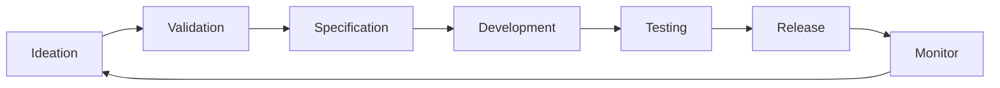

# Product Management Documentation

## 🚀 Tổng quan

Thư mục này chứa tất cả tài liệu liên quan đến quản lý sản phẩm Bflow ERP Platform, bao gồm roadmap, specifications, và release planning.

## 📁 Danh sách Tài liệu

### ✅ Đã hoàn thành
- [PRODUCT_ROADMAP.md](PRODUCT_ROADMAP.md) - Product Roadmap 2024
  - Version: 1.0
  - Last Updated: 2025-07-25
  - Status: ✅ Active

### 🔄 Đang phát triển
- **Product Vision & Strategy**
  - Long-term vision (3-5 years)
  - Market analysis
  - Competitive analysis
  - Dự kiến: Q1 2024

- **Feature Specifications**
  - Detailed feature requirements
  - User stories với acceptance criteria
  - Mockups và wireframes
  - Dự kiến: Ongoing

- **Release Planning**
  - Release calendar
  - Feature prioritization
  - Dependencies mapping
  - Dự kiến: Q1 2024

### 📋 Kế hoạch phát triển
- **Product Metrics Dashboard** - Q2 2024
- **User Feedback Analysis** - Q2 2024
- **Market Research Reports** - Q3 2024
- **Product Marketing Plan** - Q3 2024

## 🎯 Objectives

Tài liệu Product Management nhằm:
1. Định hướng phát triển sản phẩm rõ ràng
2. Ưu tiên tính năng dựa trên giá trị kinh doanh
3. Theo dõi tiến độ và metrics
4. Đảm bảo product-market fit

## 📊 Product Metrics

### Key Performance Indicators (KPIs)
- User Adoption Rate
- Feature Usage Statistics
- Customer Satisfaction Score (CSAT)
- Net Promoter Score (NPS)
- Monthly Active Users (MAU)

### Success Criteria
- Time to Market
- Feature Delivery Rate
- Bug/Feature Ratio
- Customer Retention Rate

## 🔄 Product Development Process

## 👥 Product Team

- **Product Manager**: Leads product strategy
- **Product Owner**: Manages backlog và priorities
- **UX Designer**: Design user experience
- **Business Analyst**: Requirements analysis

## 📝 Templates

- [Feature Specification Template](../99-templates/feature-spec-template.md)
- [User Story Template](../99-templates/user-story-template.md)
- [Release Notes Template](../99-templates/release-notes-template.md)

## 🚦 Feature Status Tracking

| Feature | Status | Priority | Target Release |
|---------|--------|----------|----------------|
| Workflow Engine v1 | 🟢 Completed | High | v1.0 |
| Sales Module | 🟡 In Progress | High | v1.5 |
| HRM Module | 🟡 In Progress | High | v1.5 |
| Mobile App | 🔴 Not Started | Medium | v2.0 |
| AI Analytics | 🔴 Not Started | Low | v2.5 |

## 📈 Release History

- **v0.0.1** - Initial development version
- **v1.0** - Foundation Release (Target: Q1 2024)
- **v1.5** - Sales & HRM Release (Target: Q2 2024)
- **v2.0** - Advanced Features (Target: Q3 2024)
- **v2.5** - Enterprise Release (Target: Q4 2024)

---

**Maintained by**: Product Management Team  
**Contact**: pm-team@bflow.com  
**Slack Channel**: #product-management