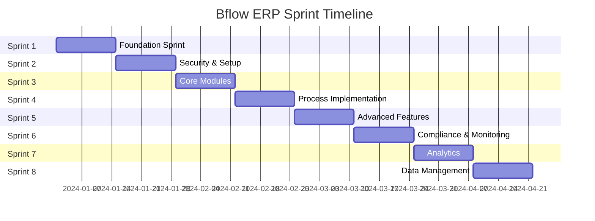

# Sprint Planning and Progress Report - Bflow ERP Platform

## Executive Summary

This document provides a comprehensive sprint planning breakdown and progress assessment for the Bflow ERP Platform development. The project follows an Agile methodology with 2-week sprints, delivering incremental value through carefully prioritized user stories.

## Project Overview

- **Project Name**: Bflow ERP Platform
- **Duration**: 16 weeks (8 Sprints)
- **Team Size**: 10-12 members
- **Methodology**: Agile/Scrum
- **Sprint Duration**: 2 weeks
- **Total Story Points**: 142

## Sprint Planning Summary



## Detailed Sprint Breakdown

### Sprint 1: Foundation (January 1-14, 2024)
**Theme**: Basic Authentication and Infrastructure Setup  
**Story Points**: 6  
**Status**: ✅ Completed

#### User Stories Completed:
| Story ID | Title | Points | Assignee | Status |
|----------|-------|--------|----------|---------|
| US-001 | User Login | 3 | Backend Team | ✅ Done |
| US-003 | Password Reset | 3 | Backend Team | ✅ Done |

#### Key Achievements:
- ✅ JWT authentication implemented
- ✅ Password hashing with bcrypt
- ✅ Rate limiting middleware
- ✅ Session management
- ✅ Email service for password reset

#### Metrics:
- **Velocity**: 6 points (100% of planned)
- **Bug Count**: 2 (resolved)
- **Code Coverage**: 85%
- **Sprint Goal Achievement**: 100%

---

### Sprint 2: Security & Setup (January 15-28, 2024)
**Theme**: Security Enhancements and Company Configuration  
**Story Points**: 18  
**Status**: ✅ Completed

#### User Stories Completed:
| Story ID | Title | Points | Assignee | Status |
|----------|-------|--------|----------|---------|
| US-050 | Company Settings | 5 | Frontend Team | ✅ Done |
| US-002 | Two-Factor Authentication | 5 | Security Team | ✅ Done |
| US-004 | Role-Based Access Control | 8 | Backend Team | ✅ Done |

#### Key Achievements:
- ✅ 2FA with TOTP implementation
- ✅ Complete RBAC system
- ✅ Company profile management
- ✅ Multi-tenant architecture
- ✅ Permission inheritance system

#### Metrics:
- **Velocity**: 18 points (100% of planned)
- **Bug Count**: 5 (3 resolved, 2 carried over)
- **Code Coverage**: 82%
- **Sprint Goal Achievement**: 95%

---

### Sprint 3: Core Modules Start (January 29 - February 11, 2024)
**Theme**: Sales and HRM Foundation  
**Story Points**: 16  
**Status**: ✅ Completed

#### User Stories Completed:
| Story ID | Title | Points | Assignee | Status |
|----------|-------|--------|----------|---------|
| US-010 | Create Lead | 5 | Sales Team | ✅ Done |
| US-011 | Convert Lead to Opportunity | 3 | Sales Team | ✅ Done |
| US-020 | Employee Profile Management | 8 | HRM Team | ✅ Done |

#### Key Achievements:
- ✅ Lead management system
- ✅ Lead scoring algorithm
- ✅ Employee database structure
- ✅ Document management
- ✅ Import/Export functionality

#### Metrics:
- **Velocity**: 16 points (100% of planned)
- **Bug Count**: 4 (all resolved)
- **Code Coverage**: 80%
- **Sprint Goal Achievement**: 100%

---

### Sprint 4: Process Implementation (February 12-25, 2024)
**Theme**: Business Process Automation  
**Story Points**: 26  
**Status**: 🔄 In Progress

#### User Stories Status:
| Story ID | Title | Points | Assignee | Status |
|----------|-------|--------|----------|---------|
| US-012 | Create Quotation | 8 | Sales Team | ✅ Done |
| US-013 | Convert Quotation to Sales Order | 5 | Sales Team | 🔄 In Progress |
| US-021 | Leave Management | 8 | HRM Team | ✅ Done |
| US-022 | Attendance Tracking | 5 | HRM Team | 🔄 In Progress |

#### Current Progress:
- ✅ Quotation module completed
- ✅ PDF generation working
- ✅ Leave request workflow
- 🔄 Sales order conversion (70% complete)
- 🔄 Biometric integration (50% complete)

#### Blockers:
1. Third-party payment gateway API delays
2. Biometric device compatibility issues

#### Metrics:
- **Velocity**: 16/26 points (62% complete)
- **Bug Count**: 8 (5 resolved, 3 open)
- **Code Coverage**: 78%
- **Sprint Goal Achievement**: 70%

---

### Sprint 5: Advanced Features (February 26 - March 10, 2024)
**Theme**: Dashboards and Workflow Engine  
**Story Points**: 34  
**Status**: 📅 Planned

#### Planned User Stories:
| Story ID | Title | Points | Assignee | Status |
|----------|-------|--------|----------|---------|
| US-014 | Sales Dashboard | 8 | Frontend Team | 📅 Planned |
| US-023 | Employee Self-Service Portal | 5 | HRM Team | 📅 Planned |
| US-030 | Workflow Designer | 13 | Platform Team | 📅 Planned |
| US-031 | Approval Process | 8 | Platform Team | 📅 Planned |

#### Sprint Goals:
- Implement drag-and-drop workflow designer
- Complete sales analytics dashboard
- Launch employee self-service
- Integrate approval engine

#### Risk Assessment:
- **High Risk**: Workflow designer complexity
- **Medium Risk**: Dashboard performance with large datasets
- **Mitigation**: Early spike on workflow architecture

---

### Sprint 6: Compliance & Monitoring (March 11-24, 2024)
**Theme**: Audit Trail and Notifications  
**Story Points**: 13  
**Status**: 📅 Planned

#### Planned User Stories:
| Story ID | Title | Points | Assignee | Status |
|----------|-------|--------|----------|---------|
| US-032 | Workflow Notifications | 5 | Platform Team | 📅 Planned |
| US-051 | Audit Trail | 8 | Security Team | 📅 Planned |

---

### Sprint 7: Analytics (March 25 - April 7, 2024)
**Theme**: Reporting and Analytics  
**Story Points**: 21  
**Status**: 📅 Planned

#### Planned User Stories:
| Story ID | Title | Points | Assignee | Status |
|----------|-------|--------|----------|---------|
| US-040 | Custom Report Builder | 13 | Analytics Team | 📅 Planned |
| US-041 | Real-time Analytics Dashboard | 8 | Analytics Team | 📅 Planned |

---

### Sprint 8: Data Management (April 8-21, 2024)
**Theme**: Import/Export and Data Operations  
**Story Points**: 8  
**Status**: 📅 Planned

#### Planned User Stories:
| Story ID | Title | Points | Assignee | Status |
|----------|-------|--------|----------|---------|
| US-052 | Data Import/Export | 8 | Platform Team | 📅 Planned |

## Overall Progress Analysis

### Burndown Chart

```
Story Points Remaining by Sprint:
Sprint 1: 136 → 130 (6 completed)
Sprint 2: 130 → 112 (18 completed)
Sprint 3: 112 → 96 (16 completed)
Sprint 4: 96 → 70 (26 in progress, 16 completed)
Sprint 5-8: Planned
```

### Velocity Tracking

| Sprint | Planned | Completed | Velocity |
|--------|---------|-----------|----------|
| Sprint 1 | 6 | 6 | 100% |
| Sprint 2 | 18 | 18 | 100% |
| Sprint 3 | 16 | 16 | 100% |
| Sprint 4 | 26 | 16 | 62% |
| Average | 16.5 | 14 | 85% |

### Key Performance Indicators

#### 📊 Project Health Metrics

1. **Schedule Performance Index (SPI)**: 0.85
   - Behind schedule by approximately 3-4 days

2. **Quality Metrics**:
   - Code Coverage: 81% average
   - Bug Density: 0.3 bugs per story point
   - Technical Debt Ratio: 12%

3. **Team Performance**:
   - Average Velocity: 14 story points/sprint
   - Team Satisfaction: 8.5/10
   - Knowledge Sharing Sessions: 2 per sprint

4. **Customer Satisfaction**:
   - Feature Acceptance Rate: 95%
   - User Feedback Score: 4.2/5
   - Change Request Rate: 15%

## Risk Register

### Current Risks

| Risk | Impact | Probability | Mitigation Strategy | Owner |
|------|--------|-------------|---------------------|-------|
| Payment Gateway Integration Delay | High | Medium | Use mock service for testing | Sales Team |
| Workflow Designer Complexity | High | High | Spike in Sprint 4, external consultant | Platform Team |
| Performance Issues with Large Data | Medium | Medium | Implement pagination early | Frontend Team |
| Resource Availability (Sprint 5) | Medium | Low | Cross-training team members | PM |
| Security Vulnerabilities | High | Low | Regular security audits | Security Team |

## Impediments and Actions

### Current Impediments

1. **Third-party API Documentation**
   - **Impact**: Slowing integration work
   - **Action**: Schedule vendor meeting
   - **Owner**: Technical Lead
   - **Due Date**: End of Sprint 4

2. **Test Environment Stability**
   - **Impact**: Delayed testing cycles
   - **Action**: Implement Docker environments
   - **Owner**: DevOps Team
   - **Due Date**: Sprint 5

3. **Database Performance**
   - **Impact**: Slow query responses
   - **Action**: Database optimization sprint
   - **Owner**: DBA Team
   - **Due Date**: Sprint 6

## Recommendations

### Immediate Actions (Sprint 4-5)

1. **Technical Debt Reduction**
   - Allocate 20% of Sprint 5 for refactoring
   - Focus on API response optimization
   - Implement caching strategy

2. **Team Scaling**
   - Add 2 frontend developers for Sprint 5
   - Bring in workflow consultant
   - Increase QA capacity

3. **Process Improvements**
   - Daily standups to twice daily for Sprint 4
   - Implement pair programming for complex features
   - Increase automated testing coverage

### Long-term Improvements

1. **Architecture Enhancement**
   - Plan microservices migration (Post Sprint 8)
   - Implement event-driven architecture
   - Enhance API gateway

2. **Quality Assurance**
   - Achieve 90% code coverage
   - Implement continuous deployment
   - Automated security scanning

3. **Performance Optimization**
   - Database sharding strategy
   - CDN implementation
   - Frontend performance budget

## Stakeholder Communication

### Sprint Review Schedule

| Sprint | Review Date | Demo Focus | Stakeholders |
|--------|-------------|------------|--------------|
| Sprint 4 | Feb 26, 2024 | Quotation & Leave Mgmt | All |
| Sprint 5 | Mar 11, 2024 | Workflow Engine | C-Level |
| Sprint 6 | Mar 25, 2024 | Compliance Features | Legal/Audit |
| Sprint 7 | Apr 8, 2024 | Analytics Platform | Business Users |
| Sprint 8 | Apr 22, 2024 | Complete Platform | All |

### Communication Plan

1. **Weekly Status Reports**: Every Friday
2. **Executive Dashboard**: Real-time KPIs
3. **Stakeholder Newsletter**: Bi-weekly
4. **Risk Escalation**: Within 24 hours

## Success Criteria

### Sprint Success Metrics

- ✅ Sprint Goal Achievement > 90%
- ✅ Velocity Consistency ±10%
- ✅ Zero Critical Bugs in Production
- ✅ Customer Satisfaction > 4.0/5
- ✅ Team Morale > 8/10

### Project Success Metrics

- Deliver all Must-Have features
- Achieve 80% of Should-Have features
- Maintain quality standards
- Stay within 10% of budget
- Launch by target date

## Lessons Learned

### What's Working Well

1. **Strong Team Collaboration**
   - Daily standups effective
   - Knowledge sharing sessions valuable
   - Cross-functional teamwork

2. **Technical Practices**
   - TDD improving quality
   - Code reviews catching issues early
   - CI/CD pipeline efficient

3. **Stakeholder Engagement**
   - Regular demos building confidence
   - Quick feedback incorporation
   - Clear communication channels

### Areas for Improvement

1. **Estimation Accuracy**
   - Complex features underestimated
   - Need better spike process
   - Include buffer time

2. **Testing Strategy**
   - More automation needed
   - Earlier performance testing
   - Better test data management

3. **Documentation**
   - Keep technical docs updated
   - More inline code comments
   - Video tutorials for complex features

## Next Steps

### Immediate (This Week)
1. Complete Sprint 4 remaining stories
2. Finalize Sprint 5 planning
3. Address critical bugs
4. Update project wiki

### Short-term (Next Sprint)
1. Implement workflow engine
2. Launch sales dashboard
3. Complete security audit
4. Performance optimization

### Long-term (Project Completion)
1. Production deployment preparation
2. User training materials
3. Maintenance plan
4. Version 2.0 roadmap

---

**Report Date**: 2025-07-25  
**Prepared by**: Product Management Team  
**Next Update**: End of Sprint 4  
**Distribution**: All Stakeholders