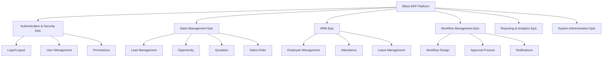

# User Stories - Bflow ERP Platform

## Overview

This document contains comprehensive user stories for the Bflow ERP Platform, organized by epics and modules. Each story follows the standard format with acceptance criteria, story points, and priority.

## Story Format

```
As a [type of user]
I want [goal/desire]
So that [benefit/value]
```

## Epic Structure



---

## 1. Authentication & Security Epic

### US-001: User Login
**Priority**: High  
**Story Points**: 3  
**Sprint**: 1

**As a** registered user  
**I want** to log in to the system securely  
**So that** I can access my authorized features and data

**Acceptance Criteria**:
- [ ] User can enter email and password
- [ ] System validates credentials against database
- [ ] Failed login shows appropriate error message
- [ ] Successful login redirects to dashboard
- [ ] Login attempts are limited to 5 per 15 minutes
- [ ] Session timeout after 30 minutes of inactivity
- [ ] Remember me option keeps user logged in for 7 days

**Technical Notes**:
- Implement JWT authentication with refresh tokens
- Use bcrypt for password hashing
- Add rate limiting middleware
- Log all authentication attempts

---

### US-002: Two-Factor Authentication
**Priority**: High  
**Story Points**: 5  
**Sprint**: 2

**As a** security-conscious user  
**I want** to enable two-factor authentication  
**So that** my account has an extra layer of security

**Acceptance Criteria**:
- [ ] User can enable 2FA in security settings
- [ ] Support for TOTP apps (Google Authenticator, Authy)
- [ ] Backup codes generated when enabling 2FA
- [ ] QR code displayed for easy setup
- [ ] Verification required after enabling
- [ ] Option to disable 2FA with password confirmation
- [ ] 2FA required on login from new devices

---

### US-003: Password Reset
**Priority**: High  
**Story Points**: 3  
**Sprint**: 1

**As a** user who forgot password  
**I want** to reset my password securely  
**So that** I can regain access to my account

**Acceptance Criteria**:
- [ ] Password reset link sent to registered email
- [ ] Link expires after 1 hour
- [ ] Link can only be used once
- [ ] New password must meet complexity requirements
- [ ] User notified via email after successful reset
- [ ] All active sessions terminated after reset
- [ ] Previous passwords cannot be reused (last 5)

---

### US-004: Role-Based Access Control
**Priority**: High  
**Story Points**: 8  
**Sprint**: 2

**As a** system administrator  
**I want** to manage user roles and permissions  
**So that** users only access authorized features

**Acceptance Criteria**:
- [ ] Create, edit, delete custom roles
- [ ] Assign multiple roles to users
- [ ] Granular permissions (view, create, edit, delete)
- [ ] Permission inheritance from role hierarchy
- [ ] Audit trail for permission changes
- [ ] Bulk permission assignment
- [ ] Role templates for common positions

**Predefined Roles**:
1. Super Admin - Full system access
2. Company Admin - Company-wide access
3. Department Manager - Department access
4. Employee - Basic access
5. Viewer - Read-only access

---

## 2. Sales Management Epic

### US-010: Create Lead
**Priority**: High  
**Story Points**: 5  
**Sprint**: 3

**As a** sales representative  
**I want** to create and manage leads  
**So that** I can track potential customers

**Acceptance Criteria**:
- [ ] Create lead with required fields (name, email, phone)
- [ ] Optional fields (company, position, source, notes)
- [ ] Automatic duplicate detection
- [ ] Lead source tracking (website, referral, campaign, etc.)
- [ ] Assign lead to sales rep
- [ ] Set follow-up reminders
- [ ] Import leads from CSV/Excel
- [ ] Lead scoring based on criteria

**Business Rules**:
- Email and phone uniqueness validation
- Automatic assignment based on territory/round-robin
- Lead status: New → Contacted → Qualified → Converted/Lost

---

### US-011: Convert Lead to Opportunity
**Priority**: High  
**Story Points**: 3  
**Sprint**: 3

**As a** sales representative  
**I want** to convert qualified leads to opportunities  
**So that** I can track sales pipeline

**Acceptance Criteria**:
- [ ] One-click conversion from lead detail page
- [ ] Carry over all lead information
- [ ] Create or link to existing account
- [ ] Set opportunity stage and probability
- [ ] Assign expected close date
- [ ] Add products/services interested in
- [ ] Original lead marked as converted
- [ ] Conversion tracked in activity history

---

### US-012: Create Quotation
**Priority**: High  
**Story Points**: 8  
**Sprint**: 4

**As a** sales representative  
**I want** to create professional quotations  
**So that** I can send pricing to customers

**Acceptance Criteria**:
- [ ] Create quotation from opportunity
- [ ] Add multiple products/services with quantities
- [ ] Apply discounts (percentage or fixed amount)
- [ ] Multiple tax rates support
- [ ] Terms and conditions selection
- [ ] Quotation validity period
- [ ] Generate PDF with company branding
- [ ] Email quotation directly to customer
- [ ] Track quotation views by customer
- [ ] Version control for quotation changes
- [ ] Approval workflow for discounts > 20%

**Calculations**:
```
Line Total = Quantity × Unit Price
Discount Amount = Line Total × Discount %
Subtotal = Sum(Line Totals - Discounts)
Tax = Subtotal × Tax Rate
Grand Total = Subtotal + Tax
```

---

### US-013: Convert Quotation to Sales Order
**Priority**: High  
**Story Points**: 5  
**Sprint**: 4

**As a** sales representative  
**I want** to convert accepted quotations to sales orders  
**So that** I can process customer purchases

**Acceptance Criteria**:
- [ ] One-click conversion from quotation
- [ ] All items and pricing carried over
- [ ] Customer PO number required
- [ ] Payment terms selection
- [ ] Delivery address confirmation
- [ ] Stock availability check
- [ ] Credit limit validation
- [ ] Order confirmation email to customer
- [ ] Commission calculation for sales rep

---

### US-014: Sales Dashboard
**Priority**: Medium  
**Story Points**: 8  
**Sprint**: 5

**As a** sales manager  
**I want** to view sales performance dashboard  
**So that** I can monitor team performance and pipeline

**Acceptance Criteria**:
- [ ] Real-time sales pipeline funnel
- [ ] Monthly/Quarterly/Yearly revenue charts
- [ ] Top performing products/services
- [ ] Sales rep performance comparison
- [ ] Win/Loss rate analysis
- [ ] Average deal size and sales cycle
- [ ] Forecast vs actual revenue
- [ ] Drill-down to detailed reports
- [ ] Export dashboard as PDF/Excel
- [ ] Mobile responsive design

**Key Metrics**:
- Total Revenue (MTD, QTD, YTD)
- Number of Deals Won/Lost
- Average Deal Size
- Sales Cycle Length
- Conversion Rates by Stage
- Pipeline Value by Stage

---

## 3. HRM (Human Resource Management) Epic

### US-020: Employee Profile Management
**Priority**: High  
**Story Points**: 8  
**Sprint**: 3

**As an** HR manager  
**I want** to manage employee profiles  
**So that** I can maintain accurate employee records

**Acceptance Criteria**:
- [ ] Create employee with personal information
- [ ] Upload profile photo and documents
- [ ] Employment details (position, department, manager)
- [ ] Contact information and emergency contacts
- [ ] Bank account details (encrypted storage)
- [ ] Educational qualifications
- [ ] Work experience history
- [ ] Skills and certifications
- [ ] Document expiry alerts (passport, visa, etc.)
- [ ] Employee self-service portal

**Data Fields**:
```
Personal: Name, DOB, Gender, Marital Status, Nationality
Contact: Address, Phone, Email, Emergency Contacts
Employment: Employee ID, Join Date, Position, Department
Documents: ID Card, Passport, Contracts, Certificates
```

---

### US-021: Leave Management
**Priority**: High  
**Story Points**: 8  
**Sprint**: 4

**As an** employee  
**I want** to request and track leave  
**So that** I can manage my time off

**Acceptance Criteria**:
- [ ] View leave balance by type
- [ ] Submit leave request with dates and reason
- [ ] Attach supporting documents if required
- [ ] Manager approval workflow
- [ ] Email notifications for status changes
- [ ] Calendar view of team leaves
- [ ] Leave conflict detection
- [ ] Public holiday integration
- [ ] Half-day leave option
- [ ] Leave cancellation with approval
- [ ] Annual leave balance carry forward

**Leave Types**:
- Annual Leave (Paid)
- Sick Leave (Paid)
- Personal Leave (Unpaid)
- Maternity/Paternity Leave
- Compassionate Leave
- Study Leave

---

### US-022: Attendance Tracking
**Priority**: High  
**Story Points**: 5  
**Sprint**: 4

**As an** HR manager  
**I want** to track employee attendance  
**So that** I can monitor punctuality and calculate payroll

**Acceptance Criteria**:
- [ ] Clock in/out via web interface
- [ ] Mobile app support with GPS
- [ ] Biometric integration capability
- [ ] Shift management and scheduling
- [ ] Overtime calculation
- [ ] Late coming and early leaving reports
- [ ] Monthly attendance summary
- [ ] Integration with leave management
- [ ] Bulk attendance upload
- [ ] Attendance regularization requests

**Business Rules**:
- Grace period: 15 minutes
- Minimum hours for full day: 8 hours
- Overtime: After 9 hours
- Weekend overtime: 1.5x rate
- Holiday overtime: 2x rate

---

### US-023: Employee Self-Service Portal
**Priority**: Medium  
**Story Points**: 5  
**Sprint**: 5

**As an** employee  
**I want** to access my information and documents  
**So that** I can manage my HR needs independently

**Acceptance Criteria**:
- [ ] View and update personal information
- [ ] Download payslips and tax documents
- [ ] Submit reimbursement claims
- [ ] View team directory and org chart
- [ ] Request HR letters (employment, salary, etc.)
- [ ] Update emergency contacts
- [ ] View company policies and handbooks
- [ ] Submit feedback and suggestions
- [ ] View benefits and enrollment

---

## 4. Workflow Management Epic

### US-030: Workflow Designer
**Priority**: High  
**Story Points**: 13  
**Sprint**: 5

**As a** system administrator  
**I want** to design custom workflows  
**So that** I can automate business processes

**Acceptance Criteria**:
- [ ] Drag-and-drop workflow designer
- [ ] Multiple workflow steps and branches
- [ ] Conditional routing based on data
- [ ] Parallel and sequential approvals
- [ ] Role-based and user-specific assignments
- [ ] Email and in-app notifications
- [ ] Escalation rules and timeouts
- [ ] Workflow templates library
- [ ] Test mode before activation
- [ ] Version control and rollback

**Workflow Components**:
1. Start/End nodes
2. Approval nodes
3. Condition nodes
4. Action nodes (email, update data)
5. Parallel gateway
6. Timer events

---

### US-031: Approval Process
**Priority**: High  
**Story Points**: 8  
**Sprint**: 5

**As an** approver  
**I want** to review and approve requests  
**So that** I can control business processes

**Acceptance Criteria**:
- [ ] Unified approval inbox
- [ ] Request details and history
- [ ] Approve/Reject with comments
- [ ] Delegate approval to another user
- [ ] Bulk approval actions
- [ ] Mobile app support
- [ ] Attachment preview
- [ ] Previous approvals visibility
- [ ] Approval deadline warnings
- [ ] Out-of-office delegation

**Approval Actions**:
- Approve
- Reject
- Request More Information
- Delegate
- Escalate

---

### US-032: Workflow Notifications
**Priority**: Medium  
**Story Points**: 5  
**Sprint**: 6

**As a** workflow participant  
**I want** to receive timely notifications  
**So that** I can act on pending tasks

**Acceptance Criteria**:
- [ ] Email notifications with action links
- [ ] In-app notifications
- [ ] Mobile push notifications
- [ ] Daily digest option
- [ ] Notification preferences by workflow
- [ ] Reminder notifications for overdue
- [ ] Escalation notifications
- [ ] CC notifications for stakeholders
- [ ] Rich notification content
- [ ] Unsubscribe options

---

## 5. Reporting & Analytics Epic

### US-040: Custom Report Builder
**Priority**: Medium  
**Story Points**: 13  
**Sprint**: 7

**As a** manager  
**I want** to create custom reports  
**So that** I can analyze business data

**Acceptance Criteria**:
- [ ] Drag-and-drop report builder
- [ ] Multiple data sources
- [ ] Various chart types (bar, line, pie, etc.)
- [ ] Filters and parameters
- [ ] Grouping and aggregation
- [ ] Scheduled report generation
- [ ] Email delivery of reports
- [ ] Export to PDF/Excel/CSV
- [ ] Report templates
- [ ] Drill-down capabilities

---

### US-041: Real-time Analytics Dashboard
**Priority**: Medium  
**Story Points**: 8  
**Sprint**: 7

**As an** executive  
**I want** to view real-time business metrics  
**So that** I can make informed decisions

**Acceptance Criteria**:
- [ ] Customizable dashboard widgets
- [ ] Real-time data refresh
- [ ] Multiple dashboard layouts
- [ ] Role-based dashboards
- [ ] Mobile responsive design
- [ ] Data filtering by date range
- [ ] Comparison with previous periods
- [ ] Alerts for threshold breaches
- [ ] Dashboard sharing
- [ ] Full-screen presentation mode

---

## 6. System Administration Epic

### US-050: Company Settings
**Priority**: High  
**Story Points**: 5  
**Sprint**: 2

**As a** company administrator  
**I want** to configure company settings  
**So that** the system reflects our business

**Acceptance Criteria**:
- [ ] Company profile (name, logo, address)
- [ ] Fiscal year configuration
- [ ] Currency and language settings
- [ ] Tax rates configuration
- [ ] Working hours and holidays
- [ ] Email templates customization
- [ ] Numbering sequences
- [ ] Department and position setup
- [ ] Branch/location management
- [ ] Integration settings

---

### US-051: Audit Trail
**Priority**: High  
**Story Points**: 8  
**Sprint**: 6

**As a** compliance officer  
**I want** to view system audit trails  
**So that** I can track all system changes

**Acceptance Criteria**:
- [ ] Track all create/update/delete actions
- [ ] User, timestamp, and IP address
- [ ] Before and after values
- [ ] Filter by user, date, module
- [ ] Export audit logs
- [ ] Tamper-proof storage
- [ ] Retention policy configuration
- [ ] Sensitive data masking
- [ ] Login/logout tracking
- [ ] Failed action attempts

---

### US-052: Data Import/Export
**Priority**: Medium  
**Story Points**: 8  
**Sprint**: 8

**As a** system administrator  
**I want** to import and export data  
**So that** I can migrate or backup data

**Acceptance Criteria**:
- [ ] Template download for each module
- [ ] CSV/Excel file upload
- [ ] Data validation before import
- [ ] Error report with row details
- [ ] Rollback failed imports
- [ ] Scheduled exports
- [ ] Incremental export options
- [ ] Field mapping interface
- [ ] Large file handling
- [ ] Progress tracking

---

## User Story Prioritization Matrix

| Story ID | Story Title | Priority | Story Points | Sprint | Dependencies |
|----------|-------------|----------|--------------|--------|--------------|
| US-001 | User Login | High | 3 | 1 | None |
| US-003 | Password Reset | High | 3 | 1 | US-001 |
| US-050 | Company Settings | High | 5 | 2 | US-001 |
| US-002 | Two-Factor Authentication | High | 5 | 2 | US-001 |
| US-004 | Role-Based Access Control | High | 8 | 2 | US-001 |
| US-010 | Create Lead | High | 5 | 3 | US-004 |
| US-011 | Convert Lead to Opportunity | High | 3 | 3 | US-010 |
| US-020 | Employee Profile Management | High | 8 | 3 | US-004 |
| US-012 | Create Quotation | High | 8 | 4 | US-011 |
| US-013 | Convert Quotation to Sales Order | High | 5 | 4 | US-012 |
| US-021 | Leave Management | High | 8 | 4 | US-020 |
| US-022 | Attendance Tracking | High | 5 | 4 | US-020 |
| US-014 | Sales Dashboard | Medium | 8 | 5 | US-013 |
| US-023 | Employee Self-Service Portal | Medium | 5 | 5 | US-021 |
| US-030 | Workflow Designer | High | 13 | 5 | US-004 |
| US-031 | Approval Process | High | 8 | 5 | US-030 |
| US-032 | Workflow Notifications | Medium | 5 | 6 | US-031 |
| US-051 | Audit Trail | High | 8 | 6 | US-004 |
| US-040 | Custom Report Builder | Medium | 13 | 7 | All modules |
| US-041 | Real-time Analytics Dashboard | Medium | 8 | 7 | All modules |
| US-052 | Data Import/Export | Medium | 8 | 8 | All modules |

## Sprint Planning

### Sprint 1 (2 weeks) - Foundation
- Total Story Points: 6
- Focus: Basic authentication
- Stories: US-001, US-003

### Sprint 2 (2 weeks) - Security & Setup
- Total Story Points: 18
- Focus: Security and company setup
- Stories: US-050, US-002, US-004

### Sprint 3 (2 weeks) - Core Modules Start
- Total Story Points: 16
- Focus: Sales and HRM basics
- Stories: US-010, US-011, US-020

### Sprint 4 (2 weeks) - Process Implementation
- Total Story Points: 26
- Focus: Business processes
- Stories: US-012, US-013, US-021, US-022

### Sprint 5 (2 weeks) - Advanced Features
- Total Story Points: 34
- Focus: Dashboards and workflows
- Stories: US-014, US-023, US-030, US-031

### Sprint 6 (2 weeks) - Compliance & Monitoring
- Total Story Points: 13
- Focus: Audit and notifications
- Stories: US-032, US-051

### Sprint 7 (2 weeks) - Analytics
- Total Story Points: 21
- Focus: Reporting and analytics
- Stories: US-040, US-041

### Sprint 8 (2 weeks) - Data Management
- Total Story Points: 8
- Focus: Data operations
- Stories: US-052

## Definition of Done

A user story is considered "Done" when:

1. **Code Complete**
   - [ ] All code written and committed
   - [ ] Code reviewed and approved
   - [ ] Follows coding standards

2. **Testing Complete**
   - [ ] Unit tests written and passing (>80% coverage)
   - [ ] Integration tests passing
   - [ ] Manual testing completed
   - [ ] No critical bugs

3. **Documentation Complete**
   - [ ] API documentation updated
   - [ ] User guide updated
   - [ ] Release notes prepared

4. **Acceptance**
   - [ ] All acceptance criteria met
   - [ ] Product Owner approval
   - [ ] Demo completed

5. **Deployment Ready**
   - [ ] Deployed to staging environment
   - [ ] Performance tested
   - [ ] Security tested

## Story Point Estimation Guide

- **1 Point**: Simple configuration change
- **2 Points**: Simple CRUD without business logic
- **3 Points**: CRUD with validation and business rules
- **5 Points**: Complex feature with multiple components
- **8 Points**: Feature requiring integration or complex logic
- **13 Points**: Major feature with multiple integrations
- **21 Points**: Epic-level feature (should be broken down)

---

**Document Version**: 1.0  
**Last Updated**: 2025-07-25  
**Product Owner**: [Name]  
**Next Review**: End of each sprint