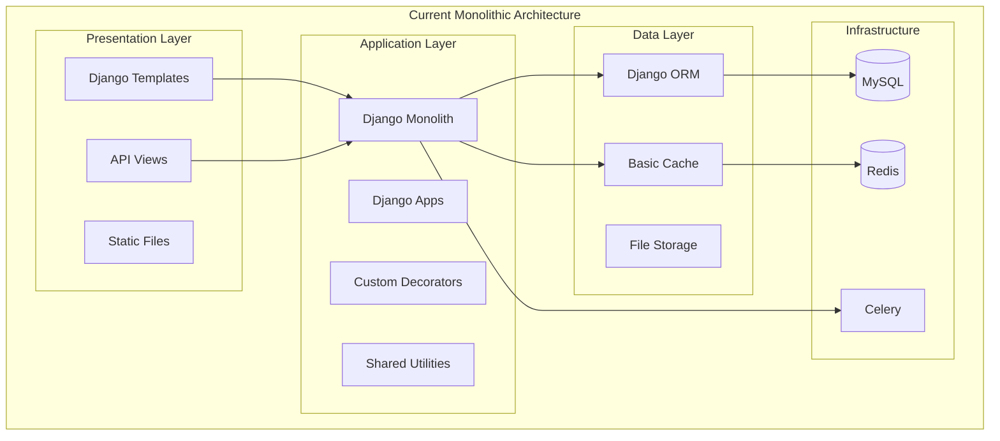
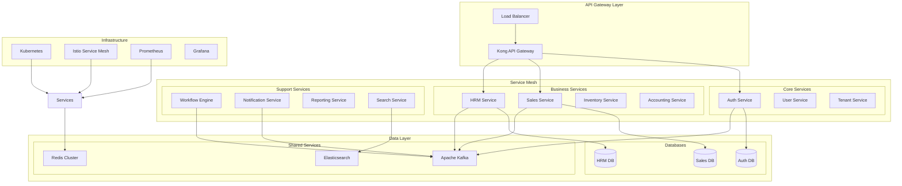

# Architecture Review & Assessment - Bflow ERP Platform

## Executive Summary

As CTO and Enterprise Architect, I've conducted a comprehensive review of the Bflow ERP Platform architecture. This document presents the current state assessment, comparison with enterprise best practices, and detailed improvement recommendations.

### Key Findings
- **Current State**: Functional monolithic Django application with good modular structure
- **Strengths**: Well-organized code, clear separation of concerns, established patterns
- **Critical Gaps**: Limited scalability, security concerns, missing enterprise features
- **Recommendation**: Gradual migration to microservices with immediate security and performance improvements

## 1. Current Architecture Assessment

### 1.1 Architecture Overview



### 1.2 Strengths of Current Architecture

1. **Good Modular Structure**
   - Clear separation by business domains (sales, hrm, core)
   - Consistent app structure
   - Shared utilities well-organized

2. **Established Patterns**
   - Decorator pattern for authentication (@mask_view)
   - Clear URL routing
   - Consistent view patterns

3. **Basic Infrastructure**
   - Celery for async tasks
   - Redis for caching
   - Docker support

### 1.3 Critical Issues Identified

#### 🔴 Security Vulnerabilities

1. **Hardcoded Secrets**
   ```python
   # In urls.py - Firebase config directly in code
   firebase.initializeApp({os.getenv("FCM_CONFIG", "")});
   
   # In settings.py
   SECRET_KEY = 'django-insecure-p8r4sbt&9q*ig^3_$ao95)n3)vq5hu40k8d4jqep8zzpt49sx1'
   ```

2. **Insufficient Input Validation**
   - Limited validation in utility classes
   - No centralized validation framework
   - SQL injection risks in raw queries

3. **Authentication Weaknesses**
   - Basic JWT implementation without refresh tokens
   - No rate limiting on authentication endpoints
   - Session management issues

#### 🟡 Performance Concerns

1. **Database Performance**
   - No connection pooling configured
   - Missing database query optimization
   - N+1 query problems likely

2. **Caching Strategy**
   - Basic cache implementation
   - No cache invalidation strategy
   - Missing CDN for static assets

3. **Frontend Performance**
   - No asset optimization
   - Synchronous JavaScript loading
   - Large bundle sizes

#### 🟡 Scalability Limitations

1. **Monolithic Constraints**
   - All modules in single deployment
   - Shared database for all modules
   - No horizontal scaling strategy

2. **Multi-tenancy Issues**
   - Basic tenant isolation
   - Shared resources without limits
   - No tenant-specific scaling

## 2. Enterprise Best Practices Comparison

### 2.1 Architecture Patterns

| Best Practice | Current State | Gap Analysis |
|--------------|---------------|--------------|
| Microservices Architecture | ❌ Monolithic | High - Limits scalability |
| API Gateway | ❌ Direct access | High - No centralized API management |
| Service Mesh | ❌ Not implemented | Medium - Needed for microservices |
| Event-Driven Architecture | ⚠️ Basic (Celery) | Medium - Limited event patterns |
| CQRS Pattern | ❌ Not implemented | Medium - Needed for complex queries |

### 2.2 Security Standards

| Best Practice | Current State | Gap Analysis |
|--------------|---------------|--------------|
| Zero Trust Security | ❌ Perimeter-based | Critical - Modern security required |
| OAuth 2.0/OIDC | ⚠️ Basic JWT | High - Standard authentication needed |
| API Rate Limiting | ❌ Not implemented | High - DDoS vulnerability |
| Encryption at Rest | ❌ Not implemented | Critical - Data protection required |
| Security Headers | ⚠️ Basic | Medium - Need comprehensive headers |

### 2.3 DevOps & Operations

| Best Practice | Current State | Gap Analysis |
|--------------|---------------|--------------|
| CI/CD Pipeline | ⚠️ Basic Jenkins | Medium - Need modern pipeline |
| Infrastructure as Code | ⚠️ Docker only | High - Need Terraform/Kubernetes |
| Observability | ⚠️ Basic logging | High - Need full observability |
| Chaos Engineering | ❌ Not practiced | Low - Future consideration |
| GitOps | ❌ Not implemented | Medium - Better deployment control |

## 3. Detailed Technical Recommendations

### 3.1 Immediate Actions (0-3 months)

#### Security Hardening
```python
# 1. Move secrets to environment variables with validation
import os
from django.core.exceptions import ImproperlyConfigured

def get_env_variable(var_name, default=None):
    """Get environment variable or raise exception"""
    try:
        return os.environ[var_name]
    except KeyError:
        if default is not None:
            return default
        error_msg = f"Set the {var_name} environment variable"
        raise ImproperlyConfigured(error_msg)

# 2. Implement proper secret management
SECRET_KEY = get_env_variable('DJANGO_SECRET_KEY')
DATABASE_PASSWORD = get_env_variable('DB_PASSWORD')

# 3. Add security middleware
MIDDLEWARE = [
    'django.middleware.security.SecurityMiddleware',
    'csp.middleware.CSPMiddleware',  # Content Security Policy
    'django_ratelimit.middleware.RatelimitMiddleware',  # Rate limiting
    # ... other middleware
]

# 4. Configure security headers
SECURE_BROWSER_XSS_FILTER = True
SECURE_CONTENT_TYPE_NOSNIFF = True
X_FRAME_OPTIONS = 'DENY'
SECURE_SSL_REDIRECT = True
SESSION_COOKIE_SECURE = True
CSRF_COOKIE_SECURE = True
```

#### Performance Optimization
```python
# 1. Database connection pooling
DATABASES = {
    'default': {
        'ENGINE': 'django.db.backends.mysql',
        'OPTIONS': {
            'init_command': "SET sql_mode='STRICT_TRANS_TABLES'",
            'charset': 'utf8mb4',
            'pool_size': 10,
            'max_overflow': 20,
            'pool_timeout': 30,
            'pool_recycle': 3600,
        }
    }
}

# 2. Implement query optimization
from django.db.models import Prefetch, select_related, prefetch_related

class OptimizedEmployeeViewSet(ModelViewSet):
    def get_queryset(self):
        return Employee.objects.select_related(
            'department', 'manager'
        ).prefetch_related(
            'skills', 'projects'
        ).annotate(
            total_leaves=Count('leave_requests')
        )

# 3. Advanced caching strategy
CACHES = {
    'default': {
        'BACKEND': 'django_redis.cache.RedisCache',
        'LOCATION': 'redis://127.0.0.1:6379/1',
        'OPTIONS': {
            'CLIENT_CLASS': 'django_redis.client.DefaultClient',
            'CONNECTION_POOL_KWARGS': {
                'max_connections': 50,
                'retry_on_timeout': True
            },
            'COMPRESSOR': 'django_redis.compressors.zlib.ZlibCompressor',
        }
    }
}
```

### 3.2 Short-term Improvements (3-6 months)

#### API Gateway Implementation
```yaml
# Kong API Gateway configuration
services:
  - name: bflow-auth-service
    url: http://auth-service:8000
    routes:
      - name: auth-route
        paths:
          - /api/v1/auth
        methods:
          - GET
          - POST
    plugins:
      - name: rate-limiting
        config:
          minute: 100
          policy: local
      - name: jwt
        config:
          claims_to_verify:
            - exp
            - nbf

  - name: bflow-sales-service
    url: http://sales-service:8000
    routes:
      - name: sales-route
        paths:
          - /api/v1/sales
    plugins:
      - name: cors
      - name: request-transformer
        config:
          add:
            headers:
              - X-Tenant-ID:{{tenant_id}}
```

#### Microservices Preparation
```python
# Service boundary definition
MICROSERVICES_MAPPING = {
    'auth-service': ['core.account', 'core.auths'],
    'sales-service': ['sales.*'],
    'hrm-service': ['hrm.*', 'eoffice.*'],
    'workflow-service': ['core.workflow', 'core.process'],
    'notification-service': ['core.mailer', 'core.firebase'],
}

# Implement service communication
from abc import ABC, abstractmethod

class ServiceClient(ABC):
    @abstractmethod
    async def call_service(self, service_name: str, endpoint: str, **kwargs):
        pass

class HTTPServiceClient(ServiceClient):
    async def call_service(self, service_name: str, endpoint: str, **kwargs):
        service_url = self.get_service_url(service_name)
        async with aiohttp.ClientSession() as session:
            async with session.post(f"{service_url}{endpoint}", **kwargs) as resp:
                return await resp.json()

# Event-driven communication
from kombu import Exchange, Queue

CELERY_TASK_ROUTES = {
    'auth.*': {'queue': 'auth_queue'},
    'sales.*': {'queue': 'sales_queue'},
    'hrm.*': {'queue': 'hrm_queue'},
}

event_exchange = Exchange('bflow_events', type='topic')

CELERY_QUEUES = (
    Queue('auth_queue', event_exchange, routing_key='auth.#'),
    Queue('sales_queue', event_exchange, routing_key='sales.#'),
    Queue('hrm_queue', event_exchange, routing_key='hrm.#'),
)
```

### 3.3 Long-term Architecture (6-12 months)

#### Target Microservices Architecture



#### Domain-Driven Design Implementation

```python
# Bounded Context Definition
from dataclasses import dataclass
from typing import List, Optional
from abc import ABC, abstractmethod

# Domain Events
@dataclass
class DomainEvent:
    aggregate_id: str
    event_type: str
    timestamp: datetime
    data: dict

# Aggregates
class AggregateRoot(ABC):
    def __init__(self, id: str):
        self.id = id
        self._events: List[DomainEvent] = []
    
    def add_event(self, event: DomainEvent):
        self._events.append(event)
    
    @property
    def uncommitted_events(self) -> List[DomainEvent]:
        return self._events

# Sales Bounded Context
class Order(AggregateRoot):
    def __init__(self, order_id: str, customer_id: str):
        super().__init__(order_id)
        self.customer_id = customer_id
        self.items: List[OrderItem] = []
        self.status = OrderStatus.DRAFT
    
    def add_item(self, product_id: str, quantity: int, price: Decimal):
        if self.status != OrderStatus.DRAFT:
            raise DomainException("Cannot modify confirmed order")
        
        item = OrderItem(product_id, quantity, price)
        self.items.append(item)
        
        self.add_event(DomainEvent(
            aggregate_id=self.id,
            event_type="OrderItemAdded",
            timestamp=datetime.now(),
            data={
                "product_id": product_id,
                "quantity": quantity,
                "price": str(price)
            }
        ))

# Repository Pattern
class OrderRepository(ABC):
    @abstractmethod
    async def save(self, order: Order) -> None:
        pass
    
    @abstractmethod
    async def get_by_id(self, order_id: str) -> Optional[Order]:
        pass

# Application Service
class OrderService:
    def __init__(self, 
                 order_repo: OrderRepository,
                 event_publisher: EventPublisher):
        self.order_repo = order_repo
        self.event_publisher = event_publisher
    
    async def create_order(self, command: CreateOrderCommand) -> str:
        order = Order(
            order_id=str(uuid.uuid4()),
            customer_id=command.customer_id
        )
        
        for item in command.items:
            order.add_item(
                product_id=item.product_id,
                quantity=item.quantity,
                price=item.price
            )
        
        await self.order_repo.save(order)
        
        # Publish domain events
        for event in order.uncommitted_events:
            await self.event_publisher.publish(event)
        
        return order.id
```

## 4. Implementation Roadmap

### Phase 1: Foundation (Months 1-3)
- [ ] Security hardening and secret management
- [ ] Performance optimization and monitoring
- [ ] API standardization and documentation
- [ ] Database optimization and connection pooling
- [ ] Comprehensive testing framework

### Phase 2: Service Extraction (Months 4-6)
- [ ] Extract Authentication service
- [ ] Extract Notification service
- [ ] Implement API Gateway
- [ ] Set up service discovery
- [ ] Implement distributed tracing

### Phase 3: Core Services (Months 7-9)
- [ ] Extract Sales service
- [ ] Extract HRM service
- [ ] Implement event-driven architecture
- [ ] Set up Kubernetes infrastructure
- [ ] Implement service mesh

### Phase 4: Advanced Features (Months 10-12)
- [ ] Extract remaining services
- [ ] Implement CQRS for reporting
- [ ] Set up multi-region deployment
- [ ] Implement advanced monitoring
- [ ] Complete migration

## 5. Risk Mitigation Strategy

### Technical Risks
| Risk | Impact | Probability | Mitigation |
|------|--------|-------------|------------|
| Data inconsistency during migration | High | Medium | Implement event sourcing, dual writes |
| Service communication failures | High | Medium | Circuit breakers, retry mechanisms |
| Performance degradation | Medium | Low | Gradual migration, performance testing |
| Security vulnerabilities | High | Medium | Security audit, penetration testing |

### Migration Strategy
1. **Strangler Fig Pattern**: Gradually replace monolith
2. **Database per Service**: Gradual data separation
3. **Feature Toggles**: Control rollout
4. **Canary Deployments**: Minimize risk
5. **Rollback Plan**: Quick recovery

## 6. Success Metrics

### Technical Metrics
- Response time: < 100ms (p95)
- Availability: > 99.95%
- Error rate: < 0.1%
- Deployment frequency: Daily
- Mean time to recovery: < 30 minutes

### Business Metrics
- User satisfaction: > 4.5/5
- Feature delivery: 2x faster
- Operating cost: 30% reduction
- Scalability: 10x capacity

## 7. Conclusion

The Bflow ERP Platform has a solid foundation but requires significant architectural improvements to meet enterprise standards. The recommended approach balances immediate security needs with long-term scalability goals.

### Key Recommendations:
1. **Immediate**: Fix security vulnerabilities and optimize performance
2. **Short-term**: Prepare for microservices with API gateway and service boundaries
3. **Long-term**: Complete microservices migration with full observability

### Investment Required:
- **Team**: 2 architects, 4 senior developers, 2 DevOps engineers
- **Timeline**: 12 months for full transformation
- **Budget**: Estimated $500K-$750K
- **ROI**: 18-24 months

---

**Document Version**: 1.0  
**Review Date**: 2025-07-25  
**Next Review**: Quarterly  
**Prepared by**: CTO & Enterprise Architecture Team