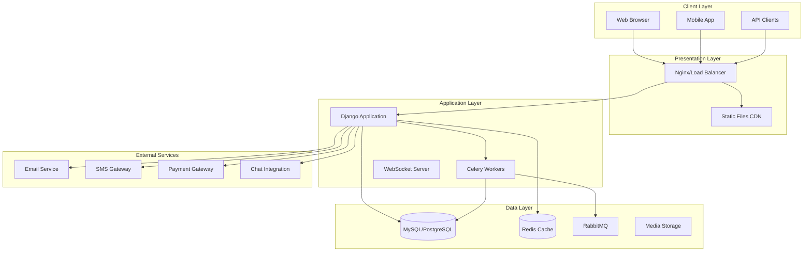
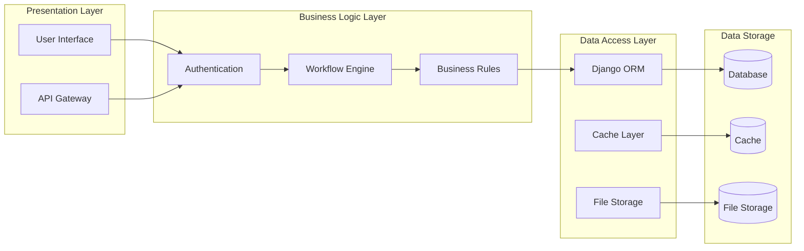
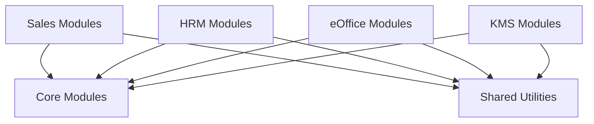
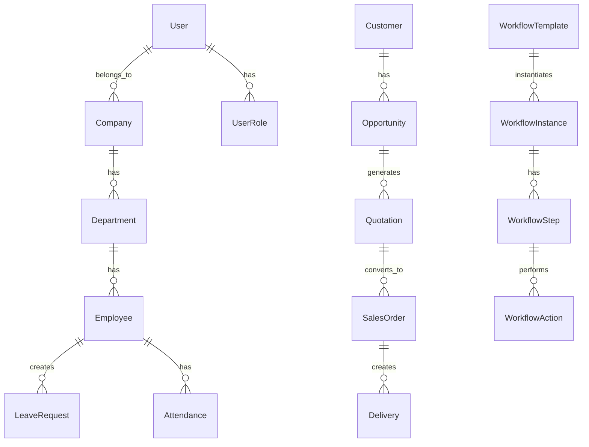
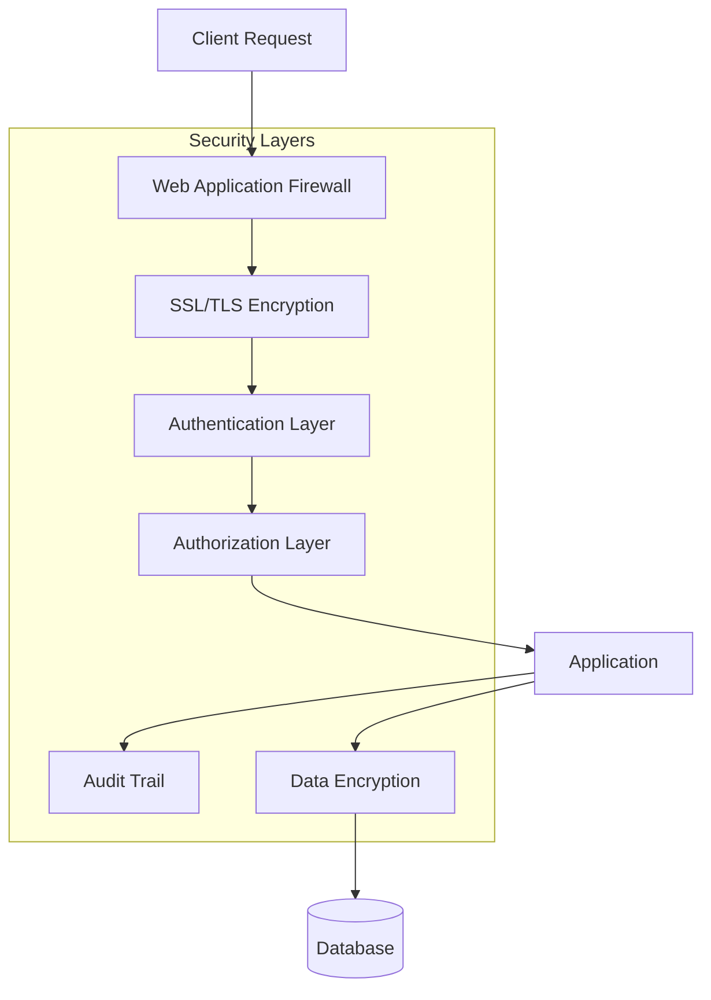
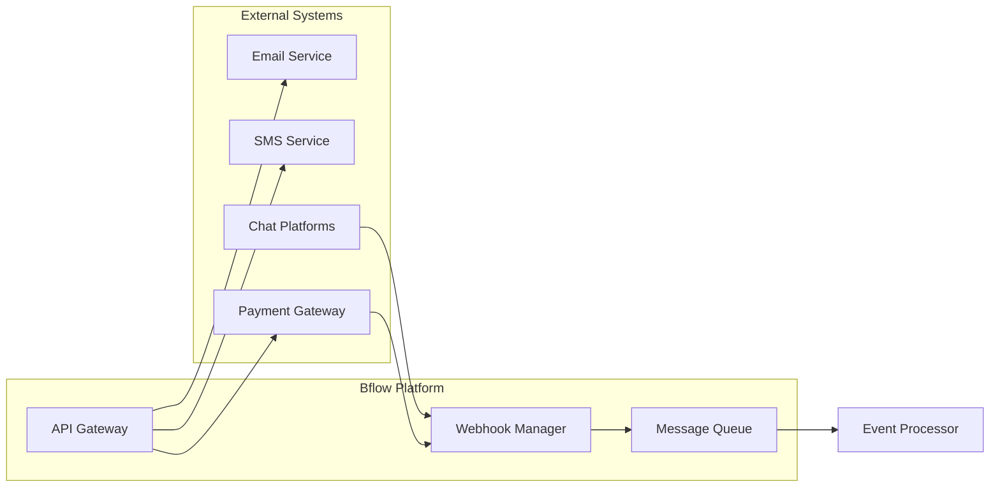
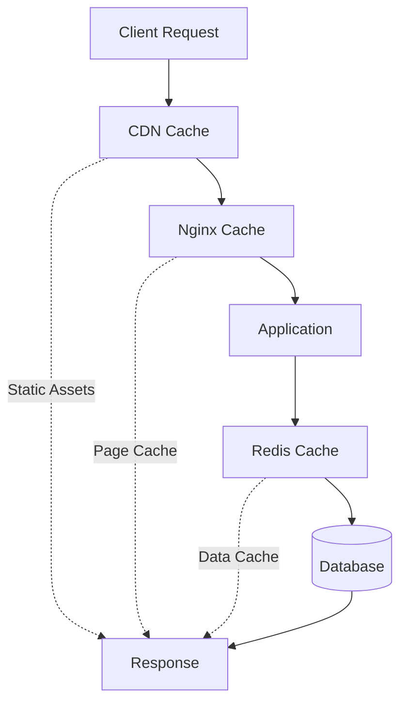
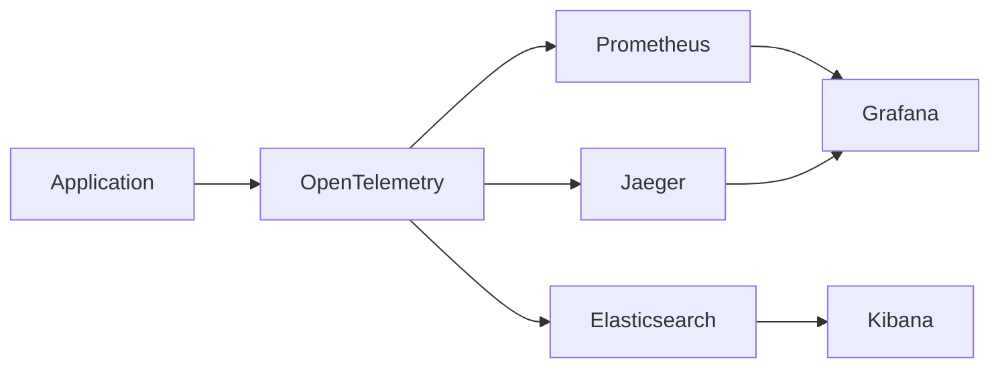
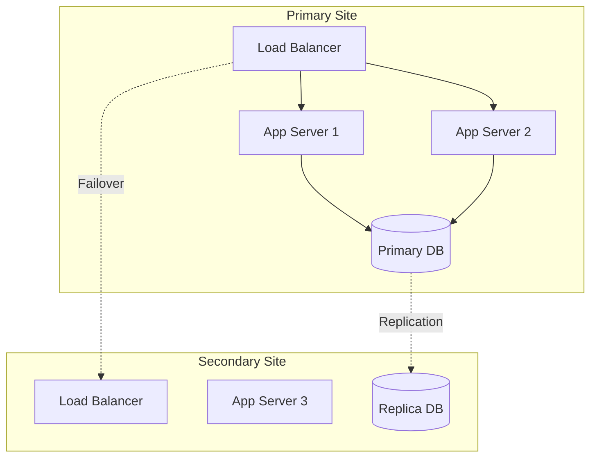

# Technical Architecture Document - Bflow ERP Platform

## 1. Tổng quan Kiến trúc

### 1.1 Architecture Overview



### 1.2 Architecture Principles

1. **Modular Design**: Tách biệt các module độc lập
2. **Scalability**: Khả năng mở rộng theo chiều ngang
3. **Security First**: Bảo mật ở mọi tầng
4. **API-Driven**: RESTful API cho mọi tính năng
5. **Multi-tenant**: Hỗ trợ nhiều tenant độc lập

## 2. Technology Stack

### 2.1 Backend Stack

| Component | Technology | Version | Purpose |
|-----------|------------|---------|---------|
| Framework | Django | 4.1.3 | Web framework chính |
| Language | Python | 3.11 | Ngôn ngữ lập trình |
| API Framework | Django REST Framework | 3.14.0 | RESTful API |
| Task Queue | Celery | 5.2.7 | Xử lý bất đồng bộ |
| Message Broker | RabbitMQ | Latest | Message queue |
| Cache | Redis | Latest | Caching & Session |
| Database | MySQL/PostgreSQL | 8.0/14.0 | Primary database |

### 2.2 Frontend Stack

| Component | Technology | Purpose |
|-----------|------------|---------|
| Template Engine | Django Templates | Server-side rendering |
| JavaScript | jQuery, Vanilla JS | Client-side logic |
| CSS Framework | Bootstrap 5 | UI components |
| Charts | ApexCharts, Chart.js | Data visualization |
| Datatables | DataTables.net | Table management |
| Form Validation | jQuery Validation | Form handling |

### 2.3 Infrastructure

| Component | Technology | Purpose |
|-----------|------------|---------|
| Container | Docker | Containerization |
| Orchestration | Docker Compose | Multi-container apps |
| Web Server | Nginx | Reverse proxy |
| Application Server | Gunicorn | WSGI server |
| Monitoring | OpenTelemetry | Application monitoring |
| CI/CD | Jenkins | Continuous integration |

## 3. System Architecture

### 3.1 Layered Architecture



### 3.2 Component Architecture

#### 3.2.1 Django Application Structure

```
apps/
├── core/                    # Core modules
│   ├── account/            # User management
│   ├── auths/              # Authentication
│   ├── workflow/           # Workflow engine
│   ├── form/               # Dynamic forms
│   └── ...
├── sales/                  # Sales modules
│   ├── opportunity/        # Opportunity management
│   ├── quotation/          # Quotation
│   ├── saleorder/          # Sales orders
│   └── ...
├── hrm/                    # Human resource modules
│   ├── employee/           # Employee management
│   ├── attendance/         # Attendance tracking
│   └── ...
├── shared/                 # Shared utilities
│   ├── apis/              # API utilities
│   ├── utils/             # Common utilities
│   └── ...
└── sharedapp/             # Shared Django app
```

#### 3.2.2 Module Dependencies



## 4. Database Design

### 4.1 Database Schema Strategy

- **Multi-tenant Architecture**: Shared database with tenant isolation
- **Audit Trail**: Tất cả bảng có created_at, updated_at, created_by, updated_by
- **Soft Delete**: Sử dụng is_deleted flag thay vì xóa vật lý
- **UUID**: Sử dụng UUID cho external references

### 4.2 Key Database Tables



### 4.3 Database Optimization

1. **Indexing Strategy**
   - Primary key indexes
   - Foreign key indexes
   - Composite indexes for queries
   - Full-text search indexes

2. **Partitioning**
   - Table partitioning by tenant
   - Time-based partitioning for logs

3. **Connection Pooling**
   - Database connection pooling
   - Read replica for reports

## 5. Security Architecture

### 5.1 Security Layers



### 5.2 Security Implementation

1. **Authentication**
   - JWT token-based authentication
   - Two-factor authentication (2FA)
   - Session management
   - Password policies

2. **Authorization**
   - Role-based access control (RBAC)
   - Permission-based access
   - API key management
   - OAuth 2.0 support

3. **Data Security**
   - Encryption at rest
   - Encryption in transit
   - Field-level encryption
   - PII data masking

4. **Application Security**
   - CSRF protection
   - XSS prevention
   - SQL injection prevention
   - Input validation

## 6. API Architecture

### 6.1 RESTful API Design

```
Base URL: https://api.bflow.com/v1

Endpoints:
GET    /api/v1/users           # List users
POST   /api/v1/users           # Create user
GET    /api/v1/users/{id}      # Get user details
PUT    /api/v1/users/{id}      # Update user
DELETE /api/v1/users/{id}      # Delete user

Headers:
Authorization: Bearer {token}
Content-Type: application/json
X-Tenant-ID: {tenant_id}
```

### 6.2 API Response Format

```json
{
    "status": true,
    "message": "Success",
    "data": {
        "items": [],
        "pagination": {
            "page": 1,
            "per_page": 20,
            "total": 100
        }
    },
    "errors": null,
    "timestamp": "2024-01-01T00:00:00Z"
}
```

### 6.3 API Versioning Strategy

- URL versioning: `/api/v1/`, `/api/v2/`
- Backward compatibility for 2 versions
- Deprecation notices in headers
- Migration guides for breaking changes

## 7. Integration Architecture

### 7.1 Integration Patterns



### 7.2 Integration Technologies

1. **Synchronous Integration**
   - REST APIs
   - GraphQL (future)
   - SOAP (legacy support)

2. **Asynchronous Integration**
   - Webhooks
   - Message queues
   - Event streaming

3. **File-based Integration**
   - CSV/Excel import/export
   - PDF generation
   - Document processing

## 8. Performance Architecture

### 8.1 Caching Strategy



### 8.2 Performance Optimization

1. **Frontend Optimization**
   - Minification & bundling
   - Lazy loading
   - Image optimization
   - CDN for static assets

2. **Backend Optimization**
   - Database query optimization
   - N+1 query prevention
   - Bulk operations
   - Background job processing

3. **Caching Levels**
   - Browser cache
   - CDN cache
   - Application cache
   - Database cache

## 9. Deployment Architecture

### 9.1 Container Architecture

```yaml
version: '3.8'
services:
  web:
    build: .
    ports:
      - "8000:8000"
    depends_on:
      - db
      - redis
      
  db:
    image: mysql:8.0
    environment:
      MYSQL_ROOT_PASSWORD: secret
      
  redis:
    image: redis:alpine
    
  celery:
    build: .
    command: celery worker
    
  nginx:
    image: nginx:alpine
    ports:
      - "80:80"
```

### 9.2 Deployment Environments

| Environment | Purpose | Configuration |
|------------|---------|---------------|
| Development | Local development | Docker Compose |
| Testing | QA testing | Kubernetes (staging) |
| UAT | User acceptance | Kubernetes (pre-prod) |
| Production | Live system | Kubernetes (prod) |

## 10. Monitoring & Logging

### 10.1 Monitoring Stack



### 10.2 Monitoring Metrics

1. **Application Metrics**
   - Response time
   - Error rate
   - Throughput
   - Active users

2. **Infrastructure Metrics**
   - CPU usage
   - Memory usage
   - Disk I/O
   - Network traffic

3. **Business Metrics**
   - User activity
   - Transaction volume
   - Feature usage
   - Error patterns

## 11. Disaster Recovery

### 11.1 Backup Strategy

- **Database**: Daily automated backups, 30-day retention
- **Files**: Incremental backups, offsite storage
- **Configuration**: Version controlled
- **Recovery Time Objective (RTO)**: 4 hours
- **Recovery Point Objective (RPO)**: 24 hours

### 11.2 High Availability



## 12. Future Architecture Considerations

### 12.1 Microservices Migration

- Decompose monolith gradually
- Service mesh implementation
- Container orchestration with Kubernetes
- Event-driven architecture

### 12.2 Technology Upgrades

- GraphQL API support
- Real-time features with WebSockets
- AI/ML integration
- Blockchain for audit trail

---

**Document Version**: 1.0  
**Last Updated**: 2025-07-25  
**Architecture Review**: Quarterly  
**Owner**: Technical Architecture Team