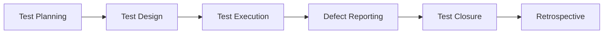

# Testing & QA Documentation

## 🧪 Tổng quan

Thư mục này chứa tất cả tài liệu liên quan đến testing strategy, test plans, test cases và QA processes cho Bflow ERP Platform.

## 📁 Danh sách Tài liệu

### 🔄 Đang phát triển
- **Test Strategy Document**
  - Overall testing approach
  - Test levels và types
  - Tools và frameworks
  - Dự kiến: Q1 2024

- **Master Test Plan**
  - Scope và objectives
  - Test schedule
  - Resource allocation
  - Risk assessment
  - Dự kiến: Q1 2024

- **Test Case Repository**
  - Functional test cases
  - Integration test cases
  - Performance test cases
  - Security test cases
  - Dự kiến: Ongoing

### 📋 Kế hoạch phát triển
- **Automation Framework Guide** - Q2 2024
- **Performance Testing Guide** - Q2 2024
- **Security Testing Playbook** - Q3 2024
- **UAT Guidelines** - Q3 2024

## 🎯 Testing Objectives

1. **Quality Assurance**: Đảm bảo chất lượng sản phẩm
2. **Risk Mitigation**: Phát hiện lỗi sớm
3. **Performance**: Đảm bảo hiệu năng
4. **Security**: Kiểm tra bảo mật
5. **Usability**: Trải nghiệm người dùng

## 📊 Testing Metrics

### Coverage Targets
- Unit Test Coverage: ≥ 80%
- Integration Test Coverage: ≥ 70%
- E2E Test Coverage: ≥ 60%
- Current Overall: ~50% 🟡

### Quality Metrics
| Metric | Target | Current |
|--------|--------|---------|
| Defect Density | < 5/KLOC | 7/KLOC 🟡 |
| Test Pass Rate | > 95% | 92% 🟡 |
| Automation Rate | > 70% | 45% 🔴 |
| Regression Time | < 4 hours | 6 hours 🟡 |

## 🔧 Testing Stack

### Tools & Frameworks
- **Unit Testing**: pytest, unittest
- **API Testing**: Postman, pytest
- **UI Testing**: Selenium, Playwright
- **Performance**: JMeter, Locust
- **Security**: OWASP ZAP, Bandit

### Test Environments
| Environment | Purpose | URL |
|------------|---------|-----|
| Dev | Development testing | dev.bflow.local |
| Test | QA testing | test.bflow.com |
| UAT | User acceptance | uat.bflow.com |
| Staging | Pre-production | staging.bflow.com |

## 📝 Test Types

### Functional Testing
- Unit Tests
- Integration Tests
- System Tests
- Acceptance Tests

### Non-Functional Testing
- Performance Testing
- Security Testing
- Usability Testing
- Compatibility Testing

### Specialized Testing
- Regression Testing
- Smoke Testing
- Sanity Testing
- Exploratory Testing

## 🔄 Testing Process

## 🐛 Defect Management

### Severity Levels
- **Critical**: System crash, data loss
- **High**: Major feature broken
- **Medium**: Minor feature issue
- **Low**: Cosmetic issues

### Priority Levels
- **P1**: Fix immediately
- **P2**: Fix in current sprint
- **P3**: Fix in next release
- **P4**: Fix when possible

## 👥 QA Team Structure

- **QA Lead**: Overall QA strategy
- **Test Engineers**: Manual testing
- **Automation Engineers**: Test automation
- **Performance Engineers**: Performance testing
- **Security Testers**: Security testing

## 📝 Templates

- [Test Case Template](../99-templates/test-case-template.md)
- [Bug Report Template](../99-templates/bug-report-template.md)
- [Test Plan Template](../99-templates/test-plan-template.md)

## 🚦 Testing Dashboard

### Current Sprint
- Total Test Cases: 250
- Executed: 180 (72%)
- Passed: 165 (91.7%)
- Failed: 15 (8.3%)
- Blocked: 5

### Automation Progress
- Total Automated: 112/250 (44.8%)
- API Tests: 75/100 (75%)
- UI Tests: 37/150 (24.7%)

## 🔗 Related Resources

- [Development Guide](../08-development-guides/)
- [API Documentation](../04-api-documentation/)
- [Bug Tracking System](#)
- [Test Management Tool](#)

---

**Maintained by**: QA Team  
**Contact**: qa-team@bflow.com  
**Slack Channel**: #qa-testing