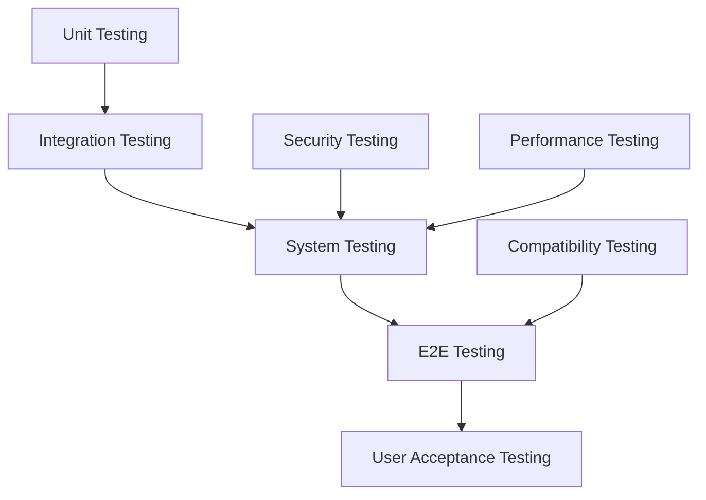

# Comprehensive Test Plan - Bflow ERP Platform

## 1. Executive Summary

This test plan outlines the comprehensive testing strategy for the Bflow ERP Platform, covering unit testing, functional testing, integration testing, and end-to-end testing. The plan ensures quality delivery through systematic testing approaches.

**Test Coverage Target**: ≥ 80% for critical modules  
**Quality Gate**: Zero critical bugs, <5 major bugs per release

## 2. Test Strategy Overview

### 2.1 Testing Levels



### 2.2 Testing Types Matrix

| Test Type | Scope | Automation | Frequency | Responsible |
|-----------|-------|------------|-----------|-------------|
| Unit Tests | Functions/Methods | 100% | Every commit | Developers |
| Integration Tests | API/Components | 80% | Daily | Dev + QA |
| Functional Tests | Features | 60% | Per feature | QA Team |
| E2E Tests | User flows | 40% | Sprint end | QA Team |
| Performance Tests | System | 50% | Release | Performance Team |
| Security Tests | System | 30% | Monthly | Security Team |

## 3. Unit Testing

### 3.1 Python/Django Unit Tests

#### Test Structure
```
tests/
├── unit/
│   ├── test_models.py
│   ├── test_views.py
│   ├── test_serializers.py
│   ├── test_utils.py
│   └── test_services.py
├── fixtures/
│   ├── users.json
│   ├── companies.json
│   └── test_data.py
└── conftest.py
```

#### Model Testing Example
```python
# tests/unit/test_models.py
import pytest
from django.test import TestCase
from django.contrib.auth import get_user_model
from apps.sales.quotation.models import Quotation, QuotationItem
from decimal import Decimal

User = get_user_model()

class QuotationModelTest(TestCase):
    """Test Quotation model functionality"""
    
    @classmethod
    def setUpTestData(cls):
        """Set up test data for all test methods"""
        cls.user = User.objects.create_user(
            username='testuser',
            email='test@example.com',
            password='testpass123'
        )
        
        cls.quotation = Quotation.objects.create(
            number='QT-2024-001',
            customer_name='Test Customer',
            customer_email='customer@test.com',
            created_by=cls.user,
            status='draft'
        )
    
    def test_string_representation(self):
        """Test model string representation"""
        self.assertEqual(str(self.quotation), 'QT-2024-001')
    
    def test_default_values(self):
        """Test default field values"""
        self.assertEqual(self.quotation.status, 'draft')
        self.assertEqual(self.quotation.discount_amount, Decimal('0.00'))
        self.assertEqual(self.quotation.tax_rate, Decimal('10.00'))
    
    def test_calculate_totals(self):
        """Test total calculation methods"""
        # Add quotation items
        QuotationItem.objects.create(
            quotation=self.quotation,
            product_name='Product 1',
            quantity=2,
            unit_price=Decimal('100.00')
        )
        
        QuotationItem.objects.create(
            quotation=self.quotation,
            product_name='Product 2',
            quantity=1,
            unit_price=Decimal('50.00')
        )
        
        # Test calculations
        self.assertEqual(self.quotation.calculate_subtotal(), Decimal('250.00'))
        self.assertEqual(self.quotation.calculate_tax(), Decimal('25.00'))
        self.assertEqual(self.quotation.calculate_total(), Decimal('275.00'))
    
    def test_status_transitions(self):
        """Test quotation status transitions"""
        # Draft to sent
        self.assertTrue(self.quotation.can_send())
        self.quotation.mark_as_sent()
        self.assertEqual(self.quotation.status, 'sent')
        
        # Sent to accepted
        self.assertTrue(self.quotation.can_accept())
        self.quotation.mark_as_accepted()
        self.assertEqual(self.quotation.status, 'accepted')
        
        # Cannot go back to draft
        self.assertFalse(self.quotation.can_send())
    
    def test_validation(self):
        """Test model validation"""
        # Test negative discount
        self.quotation.discount_amount = Decimal('-10.00')
        with self.assertRaises(ValidationError):
            self.quotation.full_clean()
        
        # Test invalid email
        self.quotation.customer_email = 'invalid-email'
        with self.assertRaises(ValidationError):
            self.quotation.full_clean()

@pytest.mark.django_db
class TestQuotationWithPytest:
    """Test using pytest framework"""
    
    def test_quotation_factory(self, quotation_factory):
        """Test factory pattern"""
        quotation = quotation_factory(status='sent')
        assert quotation.status == 'sent'
        assert quotation.number.startswith('QT-')
    
    def test_bulk_operations(self, django_db_setup):
        """Test bulk create/update operations"""
        quotations = [
            Quotation(number=f'QT-TEST-{i}', customer_name=f'Customer {i}')
            for i in range(100)
        ]
        
        created = Quotation.objects.bulk_create(quotations)
        assert len(created) == 100
        
        # Test bulk update
        Quotation.objects.filter(number__startswith='QT-TEST').update(
            status='cancelled'
        )
        
        assert Quotation.objects.filter(status='cancelled').count() == 100
```

#### View Testing Example
```python
# tests/unit/test_views.py
from django.test import TestCase, Client
from django.urls import reverse
from rest_framework.test import APITestCase
from rest_framework import status
from django.contrib.auth import get_user_model

User = get_user_model()

class QuotationViewTest(TestCase):
    """Test quotation views"""
    
    def setUp(self):
        self.client = Client()
        self.user = User.objects.create_user(
            username='testuser',
            password='testpass123'
        )
        self.client.login(username='testuser', password='testpass123')
    
    def test_quotation_list_view(self):
        """Test quotation list view"""
        url = reverse('QuotationList')
        response = self.client.get(url)
        
        self.assertEqual(response.status_code, 200)
        self.assertTemplateUsed(response, 'sales/quotation/quotation_list.html')
        self.assertContains(response, 'Quotations')
    
    def test_quotation_create_view(self):
        """Test quotation create view"""
        url = reverse('QuotationCreate')
        response = self.client.get(url)
        
        self.assertEqual(response.status_code, 200)
        self.assertContains(response, 'Create Quotation')
    
    def test_unauthorized_access(self):
        """Test unauthorized access"""
        self.client.logout()
        url = reverse('QuotationList')
        response = self.client.get(url)
        
        self.assertEqual(response.status_code, 302)  # Redirect to login

class QuotationAPITest(APITestCase):
    """Test quotation API endpoints"""
    
    def setUp(self):
        self.user = User.objects.create_user(
            username='apiuser',
            password='apipass123'
        )
        self.client.force_authenticate(user=self.user)
    
    def test_create_quotation(self):
        """Test POST /api/v1/quotations/"""
        url = reverse('quotation-list')
        data = {
            'customer_name': 'API Test Customer',
            'customer_email': 'api@test.com',
            'items': [
                {
                    'product_name': 'Product 1',
                    'quantity': 2,
                    'unit_price': '100.00'
                }
            ]
        }
        
        response = self.client.post(url, data, format='json')
        
        self.assertEqual(response.status_code, status.HTTP_201_CREATED)
        self.assertEqual(response.data['customer_name'], 'API Test Customer')
        self.assertIn('number', response.data)
    
    def test_list_quotations_with_pagination(self):
        """Test GET /api/v1/quotations/ with pagination"""
        # Create test data
        for i in range(25):
            Quotation.objects.create(
                number=f'QT-{i:03d}',
                customer_name=f'Customer {i}',
                created_by=self.user
            )
        
        url = reverse('quotation-list')
        response = self.client.get(url, {'page': 1, 'page_size': 10})
        
        self.assertEqual(response.status_code, status.HTTP_200_OK)
        self.assertEqual(len(response.data['results']), 10)
        self.assertEqual(response.data['count'], 25)
        self.assertIsNotNone(response.data['next'])
    
    def test_filter_quotations(self):
        """Test quotation filtering"""
        # Create test data with different statuses
        Quotation.objects.create(
            number='QT-001',
            customer_name='Customer 1',
            status='draft',
            created_by=self.user
        )
        
        Quotation.objects.create(
            number='QT-002', 
            customer_name='Customer 2',
            status='sent',
            created_by=self.user
        )
        
        url = reverse('quotation-list')
        response = self.client.get(url, {'status': 'draft'})
        
        self.assertEqual(response.status_code, status.HTTP_200_OK)
        self.assertEqual(len(response.data['results']), 1)
        self.assertEqual(response.data['results'][0]['status'], 'draft')
```

#### Service/Utility Testing
```python
# tests/unit/test_services.py
from django.test import TestCase
from apps.sales.quotation.services import QuotationService
from apps.sales.quotation.utils import QuotationNumberGenerator
from unittest.mock import patch, Mock

class QuotationServiceTest(TestCase):
    """Test quotation business logic"""
    
    def setUp(self):
        self.service = QuotationService()
    
    def test_calculate_discount(self):
        """Test discount calculation"""
        # Percentage discount
        result = self.service.calculate_discount(
            amount=Decimal('100.00'),
            discount_type='percentage',
            discount_value=Decimal('10.00')
        )
        self.assertEqual(result, Decimal('10.00'))
        
        # Fixed discount
        result = self.service.calculate_discount(
            amount=Decimal('100.00'),
            discount_type='fixed',
            discount_value=Decimal('15.00')
        )
        self.assertEqual(result, Decimal('15.00'))
    
    @patch('apps.sales.quotation.services.send_email')
    def test_send_quotation_email(self, mock_send_email):
        """Test email sending with mock"""
        mock_send_email.return_value = True
        
        quotation = Mock()
        quotation.customer_email = 'test@example.com'
        quotation.number = 'QT-001'
        
        result = self.service.send_quotation(quotation)
        
        self.assertTrue(result)
        mock_send_email.assert_called_once()
        
        # Verify email parameters
        call_args = mock_send_email.call_args[1]
        self.assertEqual(call_args['to'], 'test@example.com')
        self.assertIn('QT-001', call_args['subject'])
    
    def test_number_generator(self):
        """Test quotation number generation"""
        generator = QuotationNumberGenerator()
        
        # Test format
        number = generator.generate()
        self.assertTrue(number.startswith('QT-'))
        self.assertEqual(len(number.split('-')), 3)
        
        # Test uniqueness
        numbers = [generator.generate() for _ in range(100)]
        self.assertEqual(len(numbers), len(set(numbers)))
```

### 3.2 JavaScript Unit Tests

#### Jest Configuration
```javascript
// jest.config.js
module.exports = {
    testEnvironment: 'jsdom',
    roots: ['<rootDir>/static/js'],
    testMatch: ['**/__tests__/**/*.js', '**/?(*.)+(spec|test).js'],
    transform: {
        '^.+\\.js$': 'babel-jest',
    },
    moduleNameMapper: {
        '\\.(css|less|scss|sass)$': 'identity-obj-proxy',
    },
    setupFilesAfterEnv: ['<rootDir>/tests/js/setup.js'],
    collectCoverageFrom: [
        'static/js/**/*.js',
        '!static/js/vendor/**',
    ],
    coverageThreshold: {
        global: {
            branches: 80,
            functions: 80,
            lines: 80,
            statements: 80,
        },
    },
};
```

#### JavaScript Test Examples
```javascript
// static/js/__tests__/quotation.test.js
import { QuotationCalculator } from '../quotation/calculator';
import { QuotationForm } from '../quotation/form';

describe('QuotationCalculator', () => {
    let calculator;
    
    beforeEach(() => {
        calculator = new QuotationCalculator();
    });
    
    describe('calculateLineTotal', () => {
        test('should calculate line total correctly', () => {
            const result = calculator.calculateLineTotal(10, 25.50);
            expect(result).toBe(255.00);
        });
        
        test('should handle zero quantity', () => {
            const result = calculator.calculateLineTotal(0, 100);
            expect(result).toBe(0);
        });
        
        test('should handle negative values', () => {
            expect(() => {
                calculator.calculateLineTotal(-1, 100);
            }).toThrow('Quantity must be positive');
        });
    });
    
    describe('calculateTax', () => {
        test('should calculate tax correctly', () => {
            const result = calculator.calculateTax(100, 10);
            expect(result).toBe(10);
        });
        
        test('should handle zero tax rate', () => {
            const result = calculator.calculateTax(100, 0);
            expect(result).toBe(0);
        });
    });
    
    describe('calculateTotal', () => {
        test('should calculate total with all components', () => {
            const items = [
                { quantity: 2, unitPrice: 50 },
                { quantity: 1, unitPrice: 30 }
            ];
            
            const result = calculator.calculateTotal({
                items: items,
                discountType: 'percentage',
                discountValue: 10,
                taxRate: 15
            });
            
            expect(result.subtotal).toBe(130);
            expect(result.discount).toBe(13);
            expect(result.taxAmount).toBe(17.55);
            expect(result.total).toBe(134.55);
        });
    });
});

describe('QuotationForm', () => {
    let form;
    let mockElement;
    
    beforeEach(() => {
        // Setup DOM
        document.body.innerHTML = `
            <form id="quotationForm">
                <input name="customer_name" value="Test Customer">
                <input name="customer_email" value="test@example.com">
                <button type="submit">Submit</button>
            </form>
        `;
        
        mockElement = document.getElementById('quotationForm');
        form = new QuotationForm(mockElement);
    });
    
    test('should initialize with form element', () => {
        expect(form.formElement).toBe(mockElement);
        expect(form.isValid).toBe(false);
    });
    
    test('should validate required fields', () => {
        const errors = form.validate();
        expect(errors).toHaveLength(0);
        
        // Remove required field
        mockElement.querySelector('[name="customer_name"]').value = '';
        const errorsWithEmpty = form.validate();
        
        expect(errorsWithEmpty).toContain('Customer name is required');
    });
    
    test('should validate email format', () => {
        mockElement.querySelector('[name="customer_email"]').value = 'invalid-email';
        const errors = form.validate();
        
        expect(errors).toContain('Invalid email address');
    });
    
    test('should serialize form data', () => {
        const data = form.serialize();
        
        expect(data).toEqual({
            customer_name: 'Test Customer',
            customer_email: 'test@example.com'
        });
    });
    
    test('should handle form submission', async () => {
        const mockSubmit = jest.fn().mockResolvedValue({ success: true });
        form.onSubmit = mockSubmit;
        
        await form.submit();
        
        expect(mockSubmit).toHaveBeenCalledWith({
            customer_name: 'Test Customer',
            customer_email: 'test@example.com'
        });
    });
});
```

## 4. Functional Testing

### 4.1 Test Case Template
```yaml
Test Case ID: FT-QT-001
Test Case Name: Create Quotation with Multiple Items
Module: Sales - Quotation
Priority: High
Preconditions:
  - User is logged in with sales role
  - At least one product exists in the system
  - Customer exists in the system

Test Steps:
  1. Navigate to Sales > Quotations
  2. Click "Create Quotation" button
  3. Select customer from dropdown
  4. Add first product:
     - Select product
     - Enter quantity: 5
     - Verify unit price auto-fills
  5. Add second product:
     - Click "Add Item"
     - Select different product
     - Enter quantity: 3
  6. Apply discount:
     - Select "Percentage" discount type
     - Enter 10%
  7. Review totals
  8. Click "Save" button

Expected Results:
  - Quotation created successfully
  - Quotation number generated automatically
  - Subtotal = (Product1 qty × price) + (Product2 qty × price)
  - Discount = Subtotal × 10%
  - Tax calculated on discounted amount
  - Total = Subtotal - Discount + Tax
  - Success notification displayed
  - Redirected to quotation detail page

Post-conditions:
  - Quotation saved in database
  - Quotation appears in list
  - Audit log entry created
```

### 4.2 Functional Test Automation
```python
# tests/functional/test_quotation_flow.py
from selenium import webdriver
from selenium.webdriver.common.by import By
from selenium.webdriver.support.ui import WebDriverWait
from selenium.webdriver.support import expected_conditions as EC
from selenium.webdriver.support.ui import Select
import unittest

class QuotationFunctionalTest(unittest.TestCase):
    """Functional tests for quotation module"""
    
    def setUp(self):
        self.driver = webdriver.Chrome()
        self.driver.implicitly_wait(10)
        self.base_url = "http://localhost:8000"
        
        # Login
        self.login("testuser", "testpass123")
    
    def tearDown(self):
        self.driver.quit()
    
    def login(self, username, password):
        """Helper method to login"""
        self.driver.get(f"{self.base_url}/login")
        self.driver.find_element(By.ID, "username").send_keys(username)
        self.driver.find_element(By.ID, "password").send_keys(password)
        self.driver.find_element(By.CSS_SELECTOR, "button[type='submit']").click()
        
        # Wait for dashboard
        WebDriverWait(self.driver, 10).until(
            EC.presence_of_element_located((By.CLASS_NAME, "dashboard"))
        )
    
    def test_create_quotation_flow(self):
        """Test complete quotation creation flow"""
        # Navigate to quotations
        self.driver.get(f"{self.base_url}/sales/quotations")
        
        # Click create button
        create_btn = self.driver.find_element(By.ID, "btnCreateQuotation")
        create_btn.click()
        
        # Wait for form
        WebDriverWait(self.driver, 10).until(
            EC.presence_of_element_located((By.ID, "quotationForm"))
        )
        
        # Fill customer details
        customer_select = Select(self.driver.find_element(By.ID, "customer_id"))
        customer_select.select_by_visible_text("Test Customer")
        
        # Add first item
        self.add_quotation_item("Product A", "5", "100.00")
        
        # Add second item
        add_item_btn = self.driver.find_element(By.ID, "btnAddItem")
        add_item_btn.click()
        self.add_quotation_item("Product B", "3", "150.00", row=2)
        
        # Apply discount
        discount_type = Select(self.driver.find_element(By.ID, "discount_type"))
        discount_type.select_by_value("percentage")
        
        discount_input = self.driver.find_element(By.ID, "discount_value")
        discount_input.clear()
        discount_input.send_keys("10")
        
        # Verify calculations
        subtotal = self.driver.find_element(By.ID, "subtotal").text
        self.assertEqual(subtotal, "950.00")  # (5×100) + (3×150)
        
        discount = self.driver.find_element(By.ID, "discount_amount").text
        self.assertEqual(discount, "95.00")  # 10% of 950
        
        # Submit form
        submit_btn = self.driver.find_element(By.CSS_SELECTOR, "button[type='submit']")
        submit_btn.click()
        
        # Wait for success message
        success_msg = WebDriverWait(self.driver, 10).until(
            EC.presence_of_element_located((By.CLASS_NAME, "alert-success"))
        )
        
        self.assertIn("Quotation created successfully", success_msg.text)
        
        # Verify redirect to detail page
        self.assertIn("/quotations/", self.driver.current_url)
    
    def add_quotation_item(self, product, quantity, price, row=1):
        """Helper to add quotation item"""
        row_selector = f"tr[data-row='{row}']"
        
        # Select product
        product_select = Select(
            self.driver.find_element(By.CSS_SELECTOR, f"{row_selector} .product-select")
        )
        product_select.select_by_visible_text(product)
        
        # Enter quantity
        qty_input = self.driver.find_element(
            By.CSS_SELECTOR, f"{row_selector} .quantity-input"
        )
        qty_input.clear()
        qty_input.send_keys(quantity)
        
        # Verify price
        price_input = self.driver.find_element(
            By.CSS_SELECTOR, f"{row_selector} .price-input"
        )
        self.assertEqual(price_input.get_attribute("value"), price)
    
    def test_quotation_validation(self):
        """Test form validation"""
        self.driver.get(f"{self.base_url}/sales/quotations/create")
        
        # Try to submit empty form
        submit_btn = self.driver.find_element(By.CSS_SELECTOR, "button[type='submit']")
        submit_btn.click()
        
        # Check for validation errors
        errors = self.driver.find_elements(By.CLASS_NAME, "invalid-feedback")
        self.assertGreater(len(errors), 0)
        
        # Check specific error messages
        customer_error = self.driver.find_element(
            By.CSS_SELECTOR, "#customer_id + .invalid-feedback"
        )
        self.assertEqual(customer_error.text, "Customer is required")
    
    def test_quotation_workflow(self):
        """Test quotation status workflow"""
        # Create quotation first
        quotation_id = self.create_test_quotation()
        
        # Go to detail page
        self.driver.get(f"{self.base_url}/sales/quotations/{quotation_id}")
        
        # Check initial status
        status = self.driver.find_element(By.ID, "quotation-status").text
        self.assertEqual(status, "Draft")
        
        # Send quotation
        send_btn = self.driver.find_element(By.ID, "btnSendQuotation")
        send_btn.click()
        
        # Confirm action
        WebDriverWait(self.driver, 10).until(
            EC.element_to_be_clickable((By.ID, "confirmSend"))
        ).click()
        
        # Check updated status
        WebDriverWait(self.driver, 10).until(
            EC.text_to_be_present_in_element((By.ID, "quotation-status"), "Sent")
        )
        
        # Verify email sent notification
        notification = self.driver.find_element(By.CLASS_NAME, "toast-body")
        self.assertIn("Quotation sent successfully", notification.text)
```

## 5. Integration Testing

### 5.1 API Integration Tests
```python
# tests/integration/test_api_integration.py
from rest_framework.test import APITestCase
from django.urls import reverse
from unittest.mock import patch
import responses

class QuotationAPIIntegrationTest(APITestCase):
    """Test API integrations"""
    
    def setUp(self):
        self.user = User.objects.create_user(
            username='apitest',
            password='apitest123'
        )
        self.client.force_authenticate(user=self.user)
    
    @responses.activate
    def test_customer_api_integration(self):
        """Test integration with customer service"""
        # Mock customer service response
        responses.add(
            responses.GET,
            'http://customer-service/api/customers/123',
            json={
                'id': 123,
                'name': 'Test Customer',
                'email': 'customer@test.com',
                'credit_limit': 10000
            },
            status=200
        )
        
        # Create quotation with customer reference
        url = reverse('quotation-list')
        data = {
            'customer_id': 123,
            'items': [{
                'product_id': 1,
                'quantity': 5,
                'unit_price': '100.00'
            }]
        }
        
        response = self.client.post(url, data, format='json')
        
        self.assertEqual(response.status_code, 201)
        self.assertEqual(response.data['customer_name'], 'Test Customer')
        
        # Verify customer service was called
        self.assertEqual(len(responses.calls), 1)
        self.assertIn('/customers/123', responses.calls[0].request.url)
    
    @patch('apps.sales.quotation.tasks.generate_pdf.delay')
    def test_pdf_generation_task(self, mock_task):
        """Test async PDF generation"""
        quotation = Quotation.objects.create(
            number='QT-001',
            customer_name='Test Customer',
            created_by=self.user
        )
        
        url = reverse('quotation-generate-pdf', args=[quotation.id])
        response = self.client.post(url)
        
        self.assertEqual(response.status_code, 202)
        self.assertEqual(response.data['status'], 'processing')
        
        # Verify Celery task was called
        mock_task.assert_called_once_with(quotation.id)
    
    def test_workflow_integration(self):
        """Test workflow engine integration"""
        # Create quotation requiring approval
        quotation = Quotation.objects.create(
            number='QT-001',
            customer_name='Test Customer',
            total_amount=Decimal('15000.00'),  # Above approval threshold
            created_by=self.user
        )
        
        # Submit for approval
        url = reverse('quotation-submit-approval', args=[quotation.id])
        response = self.client.post(url)
        
        self.assertEqual(response.status_code, 200)
        self.assertEqual(response.data['workflow_status'], 'pending_approval')
        
        # Verify workflow instance created
        self.assertTrue(
            WorkflowInstance.objects.filter(
                content_type__model='quotation',
                object_id=quotation.id
            ).exists()
        )
```

### 5.2 Database Integration Tests
```python
# tests/integration/test_db_integration.py
from django.test import TransactionTestCase
from django.db import transaction
from apps.sales.quotation.models import Quotation, QuotationItem

class QuotationDatabaseIntegrationTest(TransactionTestCase):
    """Test database transactions and integrity"""
    
    def test_transaction_rollback(self):
        """Test transaction rollback on error"""
        try:
            with transaction.atomic():
                quotation = Quotation.objects.create(
                    number='QT-001',
                    customer_name='Test Customer'
                )
                
                # Add items
                QuotationItem.objects.create(
                    quotation=quotation,
                    product_name='Product 1',
                    quantity=5,
                    unit_price=Decimal('100.00')
                )
                
                # Force an error
                raise Exception("Simulated error")
                
        except Exception:
            pass
        
        # Verify rollback
        self.assertEqual(Quotation.objects.count(), 0)
        self.assertEqual(QuotationItem.objects.count(), 0)
    
    def test_cascade_delete(self):
        """Test cascade delete behavior"""
        quotation = Quotation.objects.create(
            number='QT-001',
            customer_name='Test Customer'
        )
        
        # Add related data
        item1 = QuotationItem.objects.create(
            quotation=quotation,
            product_name='Product 1',
            quantity=5,
            unit_price=Decimal('100.00')
        )
        
        item2 = QuotationItem.objects.create(
            quotation=quotation,
            product_name='Product 2',
            quantity=3,
            unit_price=Decimal('150.00')
        )
        
        # Delete quotation
        quotation.delete()
        
        # Verify cascade
        self.assertEqual(QuotationItem.objects.count(), 0)
    
    def test_concurrent_updates(self):
        """Test handling of concurrent updates"""
        quotation = Quotation.objects.create(
            number='QT-001',
            customer_name='Test Customer',
            version=1
        )
        
        # Simulate two concurrent updates
        q1 = Quotation.objects.get(id=quotation.id)
        q2 = Quotation.objects.get(id=quotation.id)
        
        # Update first instance
        q1.customer_name = 'Updated Customer 1'
        q1.save()
        
        # Try to update second instance
        q2.customer_name = 'Updated Customer 2'
        
        with self.assertRaises(OptimisticLockError):
            q2.save()
```

## 6. End-to-End Testing

### 6.1 E2E Test Scenarios
```javascript
// tests/e2e/quotation.e2e.js
describe('Quotation E2E Tests', () => {
    before(() => {
        cy.exec('python manage.py flush --no-input');
        cy.exec('python manage.py loaddata test_data');
    });
    
    beforeEach(() => {
        cy.login('salesuser@example.com', 'password123');
    });
    
    it('Complete quotation to order flow', () => {
        // Create quotation
        cy.visit('/sales/quotations');
        cy.get('[data-cy=create-quotation]').click();
        
        // Fill quotation form
        cy.get('#customer-select').select2('Acme Corporation');
        
        // Add items
        cy.get('[data-cy=add-item]').click();
        cy.get('.item-row').first().within(() => {
            cy.get('.product-select').select2('Laptop Pro');
            cy.get('.quantity-input').type('5');
        });
        
        // Save quotation
        cy.get('[data-cy=save-quotation]').click();
        cy.get('.toast-success').should('contain', 'Quotation created');
        
        // Send to customer
        cy.get('[data-cy=send-quotation]').click();
        cy.get('[data-cy=confirm-send]').click();
        
        // Simulate customer acceptance
        cy.visit('/customer-portal/quotations');
        cy.get('[data-cy=accept-quotation]').click();
        
        // Verify order created
        cy.visit('/sales/orders');
        cy.get('table tbody tr').should('have.length', 1);
        cy.get('table tbody tr').first().should('contain', 'Acme Corporation');
    });
    
    it('Quotation approval workflow', () => {
        // Create high-value quotation
        cy.createQuotation({
            customer: 'Big Corp',
            items: [
                { product: 'Server Rack', quantity: 10, price: 5000 }
            ]
        });
        
        // Should require approval
        cy.get('.alert-warning').should('contain', 'Requires approval');
        cy.get('[data-cy=submit-approval]').click();
        
        // Login as manager
        cy.logout();
        cy.login('manager@example.com', 'manager123');
        
        // Approve quotation
        cy.visit('/approvals/pending');
        cy.get('[data-cy=approve-quotation]').first().click();
        cy.get('[data-cy=approval-comment]').type('Approved with 5% discount');
        cy.get('[data-cy=confirm-approval]').click();
        
        // Verify approved
        cy.login('salesuser@example.com', 'password123');
        cy.visit('/sales/quotations/1');
        cy.get('.badge-success').should('contain', 'Approved');
    });
    
    it('Quotation revision flow', () => {
        // Create and send quotation
        const quotationId = cy.createAndSendQuotation();
        
        // Customer requests revision
        cy.visit(`/customer-portal/quotations/${quotationId}`);
        cy.get('[data-cy=request-revision]').click();
        cy.get('#revision-comments').type('Please add warranty information');
        cy.get('[data-cy=submit-revision]').click();
        
        // Sales rep creates revision
        cy.visit(`/sales/quotations/${quotationId}`);
        cy.get('.alert-info').should('contain', 'Revision requested');
        cy.get('[data-cy=create-revision]').click();
        
        // Add warranty
        cy.get('[data-cy=add-note]').click();
        cy.get('#note-text').type('2-year extended warranty included');
        
        // Send revised quotation
        cy.get('[data-cy=save-send]').click();
        
        // Verify version
        cy.get('.quotation-version').should('contain', 'Version 2');
    });
});
```

### 6.2 E2E Test Configuration
```javascript
// cypress.config.js
const { defineConfig } = require('cypress');

module.exports = defineConfig({
    e2e: {
        baseUrl: 'http://localhost:8000',
        viewportWidth: 1280,
        viewportHeight: 720,
        video: true,
        screenshotOnRunFailure: true,
        defaultCommandTimeout: 10000,
        requestTimeout: 10000,
        responseTimeout: 10000,
        
        setupNodeEvents(on, config) {
            // Database tasks
            on('task', {
                'db:seed': () => {
                    // Seed test database
                    return null;
                },
                'db:clean': () => {
                    // Clean test database
                    return null;
                }
            });
            
            // Code coverage
            require('@cypress/code-coverage/task')(on, config);
            
            return config;
        },
    },
    
    env: {
        coverage: true,
        codeCoverage: {
            exclude: ['**/vendor/**', '**/static/admin/**']
        }
    }
});
```

## 7. Performance Testing

### 7.1 Load Testing Script
```python
# tests/performance/locustfile.py
from locust import HttpUser, task, between
import json
import random

class QuotationUser(HttpUser):
    wait_time = between(1, 3)
    
    def on_start(self):
        """Login before starting tasks"""
        response = self.client.post("/api/auth/login", json={
            "username": "perftest",
            "password": "perftest123"
        })
        self.token = response.json()["access_token"]
        self.headers = {"Authorization": f"Bearer {self.token}"}
    
    @task(3)
    def list_quotations(self):
        """Test quotation list endpoint"""
        self.client.get(
            "/api/v1/quotations/",
            headers=self.headers,
            name="List Quotations"
        )
    
    @task(2)
    def view_quotation(self):
        """Test quotation detail endpoint"""
        quotation_id = random.randint(1, 1000)
        self.client.get(
            f"/api/v1/quotations/{quotation_id}/",
            headers=self.headers,
            name="View Quotation"
        )
    
    @task(1)
    def create_quotation(self):
        """Test quotation creation"""
        data = {
            "customer_name": f"Customer {random.randint(1, 100)}",
            "customer_email": f"customer{random.randint(1, 100)}@test.com",
            "items": [
                {
                    "product_name": f"Product {i}",
                    "quantity": random.randint(1, 10),
                    "unit_price": round(random.uniform(10, 1000), 2)
                }
                for i in range(random.randint(1, 5))
            ]
        }
        
        with self.client.post(
            "/api/v1/quotations/",
            json=data,
            headers=self.headers,
            name="Create Quotation",
            catch_response=True
        ) as response:
            if response.status_code == 201:
                response.success()
            else:
                response.failure(f"Failed with {response.status_code}")
    
    @task(2)
    def search_quotations(self):
        """Test search functionality"""
        search_terms = ["pending", "approved", "customer", "2024"]
        term = random.choice(search_terms)
        
        self.client.get(
            f"/api/v1/quotations/?search={term}",
            headers=self.headers,
            name="Search Quotations"
        )

class AdminUser(HttpUser):
    """Simulate admin user behavior"""
    wait_time = between(2, 5)
    
    def on_start(self):
        self.client.post("/api/auth/login", json={
            "username": "admin",
            "password": "admin123"
        })
    
    @task
    def generate_report(self):
        """Test report generation"""
        self.client.get(
            "/api/v1/reports/quotations/",
            params={
                "start_date": "2024-01-01",
                "end_date": "2024-12-31",
                "format": "pdf"
            },
            name="Generate Report"
        )
```

### 7.2 Performance Test Execution
```bash
# Run load test with 100 users
locust -f tests/performance/locustfile.py --users 100 --spawn-rate 10 --run-time 5m

# Run stress test
locust -f tests/performance/locustfile.py --users 1000 --spawn-rate 50 --run-time 10m

# Run spike test
locust -f tests/performance/locustfile.py --users 500 --spawn-rate 100 --run-time 15m
```

## 8. Security Testing

### 8.1 Security Test Cases
```python
# tests/security/test_security.py
import requests
from django.test import TestCase
from django.contrib.auth import get_user_model

User = get_user_model()

class SecurityTest(TestCase):
    """Security vulnerability tests"""
    
    def setUp(self):
        self.user = User.objects.create_user(
            username='sectest',
            password='sectest123'
        )
        self.client.force_login(self.user)
    
    def test_sql_injection(self):
        """Test SQL injection vulnerability"""
        # Try SQL injection in search
        malicious_input = "'; DROP TABLE quotation; --"
        response = self.client.get(
            '/api/v1/quotations/',
            {'search': malicious_input}
        )
        
        self.assertEqual(response.status_code, 200)
        # Verify table still exists
        self.assertTrue(Quotation.objects.exists())
    
    def test_xss_prevention(self):
        """Test XSS prevention"""
        # Try to inject script
        xss_payload = '<script>alert("XSS")</script>'
        
        quotation = Quotation.objects.create(
            number='QT-XSS',
            customer_name=xss_payload,
            created_by=self.user
        )
        
        response = self.client.get(f'/quotations/{quotation.id}/')
        
        # Verify script is escaped
        self.assertNotIn('<script>', response.content.decode())
        self.assertIn('&lt;script&gt;', response.content.decode())
    
    def test_csrf_protection(self):
        """Test CSRF protection"""
        # Try POST without CSRF token
        self.client.logout()
        
        response = requests.post(
            'http://localhost:8000/api/v1/quotations/',
            json={'customer_name': 'Test'},
            cookies=self.client.cookies
        )
        
        self.assertEqual(response.status_code, 403)
    
    def test_authentication_required(self):
        """Test authentication enforcement"""
        self.client.logout()
        
        # Test protected endpoints
        endpoints = [
            '/api/v1/quotations/',
            '/api/v1/quotations/1/',
            '/quotations/',
            '/quotations/create/'
        ]
        
        for endpoint in endpoints:
            response = self.client.get(endpoint)
            self.assertIn(
                response.status_code,
                [302, 401, 403],
                f"Endpoint {endpoint} not protected"
            )
    
    def test_authorization_checks(self):
        """Test authorization between users"""
        # Create another user
        other_user = User.objects.create_user(
            username='otheruser',
            password='otherpass'
        )
        
        # Create quotation as first user
        quotation = Quotation.objects.create(
            number='QT-001',
            customer_name='Test Customer',
            created_by=self.user
        )
        
        # Login as other user
        self.client.force_login(other_user)
        
        # Try to update quotation
        response = self.client.put(
            f'/api/v1/quotations/{quotation.id}/',
            data={'customer_name': 'Hacked'},
            content_type='application/json'
        )
        
        self.assertEqual(response.status_code, 403)
```

## 9. Test Data Management

### 9.1 Test Fixtures
```python
# tests/fixtures/test_data.py
from django.contrib.auth import get_user_model
from apps.sales.quotation.models import Quotation
from decimal import Decimal

User = get_user_model()

class TestDataFactory:
    """Factory for creating test data"""
    
    @staticmethod
    def create_test_user(**kwargs):
        defaults = {
            'username': 'testuser',
            'email': 'test@example.com',
            'password': 'testpass123'
        }
        defaults.update(kwargs)
        return User.objects.create_user(**defaults)
    
    @staticmethod
    def create_test_quotation(user=None, **kwargs):
        if not user:
            user = TestDataFactory.create_test_user()
        
        defaults = {
            'number': f'QT-{Quotation.objects.count() + 1:03d}',
            'customer_name': 'Test Customer',
            'customer_email': 'customer@test.com',
            'status': 'draft',
            'created_by': user
        }
        defaults.update(kwargs)
        return Quotation.objects.create(**defaults)
    
    @classmethod
    def setup_test_scenario(cls, scenario='basic'):
        """Setup complete test scenarios"""
        scenarios = {
            'basic': cls._basic_scenario,
            'approval': cls._approval_scenario,
            'performance': cls._performance_scenario
        }
        
        return scenarios.get(scenario, cls._basic_scenario)()
    
    @classmethod
    def _basic_scenario(cls):
        """Basic test scenario"""
        users = {
            'sales': cls.create_test_user(username='salesrep'),
            'manager': cls.create_test_user(username='manager'),
            'admin': cls.create_test_user(username='admin')
        }
        
        quotations = [
            cls.create_test_quotation(
                user=users['sales'],
                status='draft'
            ),
            cls.create_test_quotation(
                user=users['sales'],
                status='sent'
            ),
            cls.create_test_quotation(
                user=users['sales'],
                status='accepted'
            )
        ]
        
        return {
            'users': users,
            'quotations': quotations
        }
```

### 9.2 Test Database Setup
```python
# tests/conftest.py
import pytest
from django.core.management import call_command

@pytest.fixture(scope='session')
def django_db_setup(django_db_setup, django_db_blocker):
    """Setup test database"""
    with django_db_blocker.unblock():
        # Load initial data
        call_command('loaddata', 'tests/fixtures/initial_data.json')
        
        # Create test indices
        call_command('migrate', '--run-syncdb')

@pytest.fixture
def api_client():
    """API client with authentication"""
    from rest_framework.test import APIClient
    from django.contrib.auth import get_user_model
    
    User = get_user_model()
    client = APIClient()
    
    user = User.objects.create_user(
        username='apitest',
        password='apitest123'
    )
    client.force_authenticate(user=user)
    
    return client

@pytest.fixture
def quotation_factory():
    """Factory for creating quotations"""
    def _create_quotation(**kwargs):
        from tests.fixtures.test_data import TestDataFactory
        return TestDataFactory.create_test_quotation(**kwargs)
    
    return _create_quotation
```

## 10. Test Reporting

### 10.1 Test Report Template
```markdown
# Test Execution Report

**Project**: Bflow ERP Platform  
**Module**: Quotation Management  
**Test Period**: 2024-01-15 to 2024-01-19  
**Environment**: UAT

## Summary

| Metric | Value |
|--------|-------|
| Total Test Cases | 250 |
| Executed | 245 |
| Passed | 235 |
| Failed | 10 |
| Blocked | 5 |
| Pass Rate | 95.9% |

## Test Coverage

| Component | Coverage | Target | Status |
|-----------|----------|--------|--------|
| Models | 92% | 80% | ✅ Pass |
| Views | 85% | 80% | ✅ Pass |
| APIs | 88% | 80% | ✅ Pass |
| JavaScript | 75% | 80% | ❌ Fail |
| Integration | 70% | 70% | ✅ Pass |

## Defects Summary

| Severity | Open | Fixed | Deferred |
|----------|------|-------|----------|
| Critical | 0 | 2 | 0 |
| Major | 3 | 5 | 1 |
| Minor | 7 | 10 | 3 |
| Trivial | 5 | 8 | 2 |

## Test Execution Details

### Unit Tests
- **Total**: 120
- **Passed**: 118
- **Failed**: 2
- **Time**: 45 seconds

Failed Tests:
1. `test_quotation_discount_calculation` - Rounding error
2. `test_concurrent_update_handling` - Race condition

### Integration Tests
- **Total**: 45
- **Passed**: 42
- **Failed**: 3
- **Time**: 3 minutes

### E2E Tests
- **Total**: 30
- **Passed**: 28
- **Failed**: 2
- **Time**: 15 minutes

### Performance Tests
- **Scenarios**: 5
- **Max Users**: 1000
- **Avg Response Time**: 150ms
- **Error Rate**: 0.05%

## Recommendations

1. **High Priority**
   - Fix JavaScript coverage gap
   - Resolve race condition in concurrent updates
   - Optimize slow API endpoints

2. **Medium Priority**
   - Add more E2E test scenarios
   - Improve test data management
   - Enhance security test coverage

3. **Low Priority**
   - Refactor old test cases
   - Update test documentation
   - Implement visual regression tests

## Sign-off

| Role | Name | Signature | Date |
|------|------|-----------|------|
| QA Lead | [Name] | _______ | [Date] |
| Dev Lead | [Name] | _______ | [Date] |
| Product Owner | [Name] | _______ | [Date] |
```

### 10.2 Continuous Testing Dashboard
```python
# tests/dashboard/metrics.py
from django.db.models import Count, Avg
from datetime import datetime, timedelta

class TestMetrics:
    """Generate test metrics for dashboard"""
    
    @staticmethod
    def get_test_summary(days=7):
        """Get test execution summary"""
        start_date = datetime.now() - timedelta(days=days)
        
        return {
            'total_runs': TestRun.objects.filter(
                created_at__gte=start_date
            ).count(),
            
            'pass_rate': TestRun.objects.filter(
                created_at__gte=start_date,
                status='passed'
            ).count() / TestRun.objects.filter(
                created_at__gte=start_date
            ).count() * 100,
            
            'avg_duration': TestRun.objects.filter(
                created_at__gte=start_date
            ).aggregate(
                Avg('duration')
            )['duration__avg'],
            
            'coverage': {
                'unit': 85,
                'integration': 72,
                'e2e': 65,
                'overall': 78
            },
            
            'defects': {
                'new': 15,
                'fixed': 22,
                'open': 31,
                'reopened': 3
            }
        }
    
    @staticmethod
    def get_test_trends():
        """Get testing trends over time"""
        # Implementation for trend analysis
        pass
```

## 11. Test Automation Framework

### 11.1 Framework Structure
```
test-automation/
├── config/
│   ├── test_settings.py
│   ├── environments.json
│   └── browsers.json
├── page_objects/
│   ├── base_page.py
│   ├── login_page.py
│   └── quotation_page.py
├── test_data/
│   ├── users.json
│   ├── products.json
│   └── scenarios.json
├── utilities/
│   ├── api_client.py
│   ├── db_helper.py
│   └── report_generator.py
├── tests/
│   ├── smoke/
│   ├── regression/
│   └── e2e/
└── reports/
    └── html/
```

### 11.2 Base Test Class
```python
# test_automation/base_test.py
import unittest
from selenium import webdriver
from selenium.webdriver.support.ui import WebDriverWait
from utilities.config_reader import ConfigReader
from utilities.logger import Logger

class BaseTest(unittest.TestCase):
    """Base test class with common functionality"""
    
    @classmethod
    def setUpClass(cls):
        """Setup test class"""
        cls.config = ConfigReader()
        cls.logger = Logger(cls.__name__)
        cls.driver = cls._get_driver()
        cls.wait = WebDriverWait(cls.driver, 10)
    
    @classmethod
    def tearDownClass(cls):
        """Cleanup after test class"""
        cls.driver.quit()
    
    @classmethod
    def _get_driver(cls):
        """Get configured webdriver"""
        browser = cls.config.get('browser', 'chrome')
        
        if browser == 'chrome':
            options = webdriver.ChromeOptions()
            options.add_argument('--disable-gpu')
            options.add_argument('--no-sandbox')
            options.add_argument('--disable-dev-shm-usage')
            
            if cls.config.get('headless', False):
                options.add_argument('--headless')
            
            return webdriver.Chrome(options=options)
        
        elif browser == 'firefox':
            options = webdriver.FirefoxOptions()
            if cls.config.get('headless', False):
                options.add_argument('--headless')
            
            return webdriver.Firefox(options=options)
    
    def setUp(self):
        """Setup before each test"""
        self.driver.delete_all_cookies()
        self.driver.get(self.config.get('base_url'))
    
    def tearDown(self):
        """Cleanup after each test"""
        if self._outcome.errors:
            self._capture_screenshot()
    
    def _capture_screenshot(self):
        """Capture screenshot on failure"""
        timestamp = datetime.now().strftime("%Y%m%d_%H%M%S")
        filename = f"screenshot_{self._testMethodName}_{timestamp}.png"
        self.driver.save_screenshot(f"reports/screenshots/{filename}")
        self.logger.error(f"Screenshot saved: {filename}")
```

## 12. Test Checklist

### Pre-Release Testing Checklist

#### Functional Testing
- [ ] All user stories acceptance criteria verified
- [ ] Cross-browser testing completed (Chrome, Firefox, Safari, Edge)
- [ ] Mobile responsive testing done
- [ ] Form validations working correctly
- [ ] Error messages displaying properly
- [ ] Success notifications working
- [ ] All CRUD operations tested
- [ ] Search and filter functionality verified
- [ ] Pagination working correctly
- [ ] File upload/download tested

#### Integration Testing
- [ ] API endpoints responding correctly
- [ ] Database transactions working
- [ ] Third-party integrations tested
- [ ] Email notifications sending
- [ ] PDF generation working
- [ ] Workflow integrations verified
- [ ] Permission checks working
- [ ] Multi-tenant isolation verified

#### Performance Testing
- [ ] Page load time < 3 seconds
- [ ] API response time < 500ms
- [ ] Concurrent user testing done
- [ ] Database query optimization verified
- [ ] Memory leaks checked
- [ ] Browser performance profiled

#### Security Testing
- [ ] Authentication working correctly
- [ ] Authorization checks verified
- [ ] CSRF protection tested
- [ ] XSS prevention verified
- [ ] SQL injection tested
- [ ] Sensitive data encrypted
- [ ] SSL/TLS configured
- [ ] Security headers present

#### Accessibility Testing
- [ ] Keyboard navigation working
- [ ] Screen reader compatible
- [ ] Color contrast sufficient
- [ ] Alt text for images
- [ ] ARIA labels present
- [ ] Tab order logical

#### Deployment Testing
- [ ] Build process successful
- [ ] Database migrations tested
- [ ] Static files serving correctly
- [ ] Environment variables set
- [ ] Backup procedures verified
- [ ] Rollback plan tested

---

**Document Version**: 1.0  
**Last Updated**: 2025-07-25  
**Maintained by**: QA Team  
**Next Review**: End of each sprint