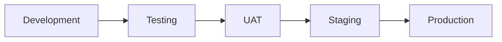

# Deployment & DevOps Documentation

## 🚀 Tổng quan

Thư mục này chứa tất cả tài liệu liên quan đến deployment, infrastructure, CI/CD, và DevOps practices cho Bflow ERP Platform.

## 📁 Danh sách Tài liệu

### 🔄 Đang phát triển
- **Deployment Guide**
  - Step-by-step deployment
  - Environment setup
  - Configuration management
  - Dự kiến: Q1 2024

- **Infrastructure Documentation**
  - Server requirements
  - Network architecture
  - Security configurations
  - Dự kiến: Q1 2024

- **CI/CD Pipeline Guide**
  - Jenkins configuration
  - Build process
  - Deployment automation
  - Dự kiến: Q2 2024

### 📋 Kế hoạch phát triển
- **Kubernetes Migration Guide** - Q3 2024
- **Disaster Recovery Plan** - Q3 2024
- **Monitoring & Alerting Setup** - Q2 2024
- **Backup & Restore Procedures** - Q2 2024

## 🎯 Deployment Strategy

### Environments


### Deployment Principles
1. **Zero Downtime**: Blue-green deployment
2. **Rollback Ready**: Quick rollback capability
3. **Automated**: Minimal manual intervention
4. **Monitored**: Real-time monitoring
5. **Secure**: Security at every layer

## 📊 Infrastructure Overview

### Current Stack
| Component | Technology | Version |
|-----------|------------|---------|
| OS | Ubuntu Server | 22.04 LTS |
| Web Server | Nginx | 1.24 |
| App Server | Gunicorn | 20.1 |
| Database | MySQL | 8.0 |
| Cache | Redis | 7.0 |
| Container | Docker | 24.0 |

### Server Requirements
| Environment | CPU | RAM | Storage | Instances |
|------------|-----|-----|---------|-----------|
| Development | 2 cores | 4GB | 50GB | 1 |
| Testing | 4 cores | 8GB | 100GB | 1 |
| UAT | 4 cores | 16GB | 200GB | 2 |
| Production | 8 cores | 32GB | 500GB | 3+ |

## 🔧 Deployment Process

### Manual Deployment Steps
```bash
# 1. Pull latest code
git pull origin main

# 2. Install dependencies
pip install -r req.txt

# 3. Run migrations
python manage.py migrate

# 4. Collect static files
python manage.py collectstatic --noinput

# 5. Restart services
sudo systemctl restart gunicorn
sudo systemctl restart nginx
```

### Docker Deployment
```bash
# 1. Build image
docker build -t bflow:latest .

# 2. Run containers
docker-compose up -d

# 3. Check status
docker-compose ps
```

## 🔄 CI/CD Pipeline

### Pipeline Stages


### Jenkins Jobs
- `bflow-build`: Build và test
- `bflow-deploy-test`: Deploy to test
- `bflow-deploy-uat`: Deploy to UAT
- `bflow-deploy-prod`: Deploy to production

## 📈 Monitoring & Logging

### Monitoring Stack
- **Metrics**: Prometheus + Grafana
- **Logs**: ELK Stack (Elasticsearch, Logstash, Kibana)
- **APM**: OpenTelemetry + Jaeger
- **Uptime**: UptimeRobot

### Key Metrics
| Metric | Target | Alert Threshold |
|--------|--------|-----------------|
| CPU Usage | < 70% | > 80% |
| Memory Usage | < 80% | > 90% |
| Disk Usage | < 85% | > 90% |
| Response Time | < 200ms | > 500ms |
| Error Rate | < 0.1% | > 1% |

## 🔐 Security Configurations

### SSL/TLS
- Let's Encrypt certificates
- Auto-renewal configured
- TLS 1.2+ only

### Firewall Rules
```bash
# Allow SSH (restricted IPs)
ufw allow from 10.0.0.0/8 to any port 22

# Allow HTTP/HTTPS
ufw allow 80/tcp
ufw allow 443/tcp

# Allow from Load Balancer
ufw allow from 172.16.0.0/12
```

## 🔄 Backup Strategy

### Backup Schedule
- **Database**: Daily at 2 AM
- **Files**: Weekly on Sunday
- **Configuration**: On every change
- **Retention**: 30 days

### Restore Testing
- Monthly restore drill
- Document restore time
- Verify data integrity

## 👥 DevOps Team

- **DevOps Lead**: Infrastructure architecture
- **Site Reliability Engineer**: Monitoring & reliability
- **Cloud Engineer**: Cloud infrastructure
- **Security Engineer**: Security compliance

## 📝 Templates

- [Deployment Checklist](../99-templates/deployment-checklist.md)
- [Runbook Template](../99-templates/runbook-template.md)
- [Incident Report Template](../99-templates/incident-template.md)

## 🚦 Deployment Status

### Recent Deployments
| Date | Version | Environment | Status | Duration |
|------|---------|-------------|---------|----------|
| 2025-07-20 | v0.9.5 | Production | ✅ Success | 15 min |
| 2025-07-18 | v0.9.4 | UAT | ✅ Success | 12 min |
| 2025-07-15 | v0.9.3 | Testing | ✅ Success | 10 min |

### Uptime Statistics
- Last 7 days: 99.95%
- Last 30 days: 99.90%
- Last 90 days: 99.85%

## 🔗 Important Links

- [Jenkins Dashboard](#)
- [Grafana Monitoring](#)
- [Kibana Logs](#)
- [Status Page](#)

---

**Maintained by**: DevOps Team  
**Contact**: devops@bflow.com  
**On-call**: +84-xxx-xxx-xxx  
**Slack Channel**: #devops