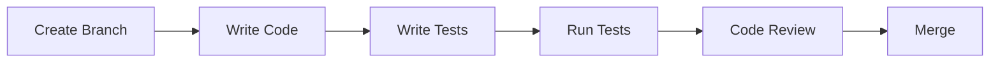

# Development Guides Documentation

## 💻 Tổng quan

Thư mục này chứa tất cả tài liệu hướng dẫn phát triển cho developers làm việc trên Bflow ERP Platform, bao gồm coding standards, best practices, và development workflows.

## 📁 Danh sách Tài liệu

### 🔄 Đang phát triển
- **Developer Onboarding Guide**
  - Environment setup
  - Project structure
  - Development tools
  - First contribution
  - Dự kiến: Q1 2024

- **Coding Standards**
  - Python/Django standards
  - JavaScript standards
  - HTML/CSS guidelines
  - Database conventions
  - Dự kiến: Q1 2024

- **Git Workflow Guide**
  - Branching strategy
  - Commit conventions
  - PR process
  - Code review
  - Dự kiến: Q1 2024

### 📋 Kế hoạch phát triển
- **Module Development Guide** - Q2 2024
- **API Development Guide** - Q2 2024
- **Testing Guide for Developers** - Q2 2024
- **Performance Optimization Guide** - Q3 2024

## 🎯 Development Principles

1. **Clean Code**: Readable, maintainable code
2. **DRY**: Don't Repeat Yourself
3. **SOLID**: Design principles
4. **Test-Driven**: Write tests first
5. **Documentation**: Code as documentation

## 📊 Tech Stack Reference

### Backend Development
```python
# Django 4.1.3 + Python 3.11
# Key libraries:
- Django REST Framework 3.14.0
- Celery 5.2.7
- pytest for testing
- Black for formatting
- Flake8 for linting
```

### Frontend Development
```javascript
// jQuery + Vanilla JS
// Key libraries:
- Bootstrap 5
- DataTables
- Select2
- Chart.js
- jQuery Validation
```

## 🔧 Development Setup

### Quick Start
```bash
# 1. Clone repository
git clone [repository-url]
cd mis_site/UI/sit

# 2. Create virtual environment
python -m venv env
source env/bin/activate  # Linux/Mac
env\Scripts\activate     # Windows

# 3. Install dependencies
pip install -r req.txt

# 4. Setup database
python manage.py migrate

# 5. Create superuser
python manage.py createsuperuser

# 6. Run development server
python manage.py runserver
```

### Docker Setup
```bash
# Build and run
docker-compose up -d

# View logs
docker-compose logs -f

# Stop containers
docker-compose down
```

## 📝 Coding Standards

### Python/Django
```python
# Good example
class EmployeeViewSet(ModelViewSet):
    """
    API endpoint for employee management.
    """
    queryset = Employee.objects.all()
    serializer_class = EmployeeSerializer
    permission_classes = [IsAuthenticated]
    
    def get_queryset(self):
        """Filter by current tenant."""
        return super().get_queryset().filter(
            tenant=self.request.user.tenant
        )
```

### JavaScript
```javascript
// Good example
const EmployeeManager = {
    init: function() {
        this.bindEvents();
        this.loadData();
    },
    
    bindEvents: function() {
        $('#btn-save').on('click', this.saveEmployee);
    },
    
    saveEmployee: function() {
        // Implementation
    }
};
```

## 🔄 Development Workflow



### Branch Naming
- Feature: `feature/ms-123-add-user-auth`
- Bugfix: `bugfix/ms-456-fix-login`
- Hotfix: `hotfix/ms-789-critical-fix`

### Commit Messages
```bash
# Format: type(scope): subject
feat(auth): add two-factor authentication
fix(sales): resolve calculation error in quotation
docs(api): update user endpoint documentation
test(hrm): add unit tests for leave module
```

## 🧪 Testing Guidelines

### Test Structure
```
tests/
├── unit/           # Unit tests
├── integration/    # Integration tests
├── e2e/           # End-to-end tests
└── fixtures/      # Test data
```

### Writing Tests
```python
# Example test
def test_create_employee(client, user):
    """Test employee creation."""
    client.force_authenticate(user=user)
    data = {
        'first_name': 'John',
        'last_name': 'Doe',
        'email': 'john@example.com'
    }
    response = client.post('/api/v1/employees/', data)
    assert response.status_code == 201
    assert response.data['email'] == data['email']
```

## 🚀 Best Practices

### Database
1. Use migrations for schema changes
2. Optimize queries with select_related()
3. Add indexes for frequent queries
4. Use transactions for data integrity

### API Development
1. Follow RESTful conventions
2. Use serializers for validation
3. Implement proper pagination
4. Return consistent responses

### Security
1. Never commit secrets
2. Validate all inputs
3. Use Django's built-in security
4. Regular dependency updates

## 👥 Development Team

### Team Structure
- **Tech Lead**: Architecture decisions
- **Backend Team**: API development
- **Frontend Team**: UI development
- **QA Team**: Testing support

### Code Review Process
1. Self-review checklist
2. Peer review required
3. Tech lead approval for core changes
4. Automated checks must pass

## 📝 Common Tasks

### Adding a New Module
```bash
# 1. Create app
python manage.py startapp module_name

# 2. Add to INSTALLED_APPS
# 3. Create models
# 4. Create views
# 5. Add URLs
# 6. Write tests
```

### Database Migrations
```bash
# Create migrations
python manage.py makemigrations

# Apply migrations
python manage.py migrate

# Rollback migration
python manage.py migrate app_name 0001
```

## 🔍 Debugging Tips

### Django Debug Toolbar
```python
# Install and configure for development
pip install django-debug-toolbar
```

### Logging
```python
import logging
logger = logging.getLogger(__name__)

logger.debug('Debug message')
logger.info('Info message')
logger.error('Error message')
```

## 🔗 Development Resources

- [Django Documentation](https://docs.djangoproject.com/)
- [DRF Documentation](https://www.django-rest-framework.org/)
- [Python Style Guide](https://peps.python.org/pep-0008/)
- [Internal Wiki](#)

---

**Maintained by**: Development Team  
**Contact**: dev-team@bflow.com  
**Slack Channel**: #development  
**Last Updated**: 2025-07-25