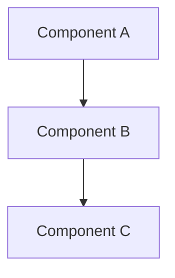

# Architecture Decision Record (ADR) Template

## ADR-[NUMBER]: [TITLE]

## Document Information
- **Date**: [YYYY-MM-DD]
- **Status**: [Proposed/Accepted/Deprecated/Superseded]
- **Deciders**: [List of people involved in decision]
- **Technical Story**: [Ticket/Issue number]

## Context and Problem Statement

[Describe the context and problem statement, e.g., in free form using two to three sentences. You may want to articulate the problem in form of a question.]

## Decision Drivers

* [driver 1, e.g., a force, facing concern, …]
* [driver 2, e.g., a force, facing concern, …]
* … <!-- numbers of drivers can vary -->

## Considered Options

* [option 1]
* [option 2]
* [option 3]
* … <!-- numbers of options can vary -->

## Decision Outcome

Chosen option: "[option 1]", because [justification. e.g., only option, which meets k.o. criterion decision driver | which resolves force force | … | comes out best (see below)].

### Positive Consequences

* [e.g., improvement of quality attribute satisfaction, follow-up decisions required, …]
* …

### Negative Consequences

* [e.g., compromising quality attribute, follow-up decisions required, …]
* …

## Pros and Cons of the Options

### [option 1]

[example | description | pointer to more information | …] <!-- optional -->

* Good, because [argument a]
* Good, because [argument b]
* Bad, because [argument c]
* … <!-- numbers of pros and cons can vary -->

### [option 2]

[example | description | pointer to more information | …] <!-- optional -->

* Good, because [argument a]
* Good, because [argument b]
* Bad, because [argument c]
* …

### [option 3]

[example | description | pointer to more information | …] <!-- optional -->

* Good, because [argument a]
* Good, because [argument b]
* Bad, because [argument c]
* …

## Links

* [Link type] [Link to ADR] <!-- example: Refined by [ADR-0005](0005-example.md) -->
* … <!-- numbers of links can vary -->

## Technical Details (Optional)

### Implementation Example
```python
# Code example if relevant
```

### Architecture Diagram


## References

* [Reference 1]
* [Reference 2]

---

**Note**: Remove this instruction section before using the template.

**Instructions for use**:
1. Copy this template when creating a new ADR
2. Replace ADR-[NUMBER] with sequential number (e.g., ADR-001)
3. Keep ADRs concise but complete
4. Link related ADRs
5. Update status when decision changes